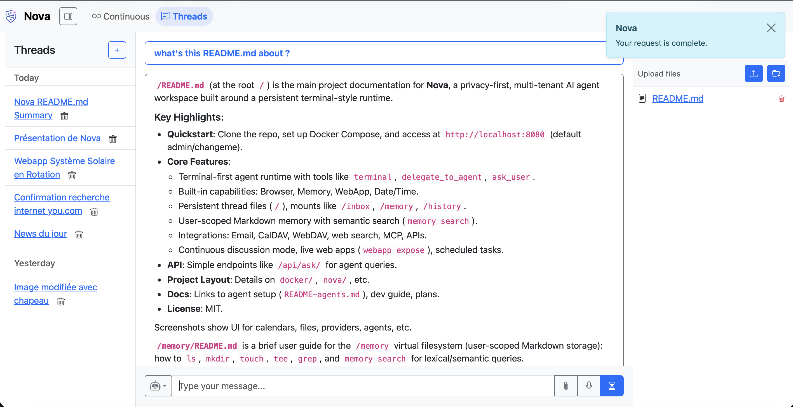
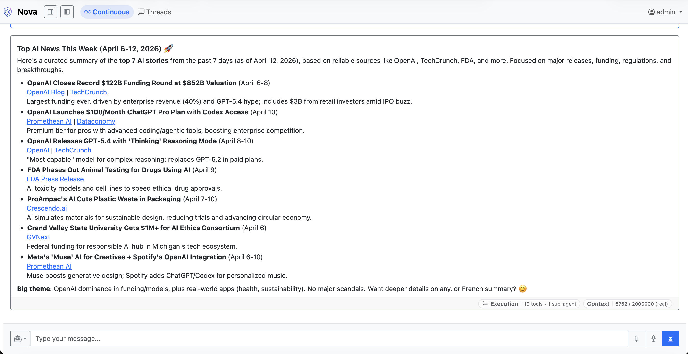
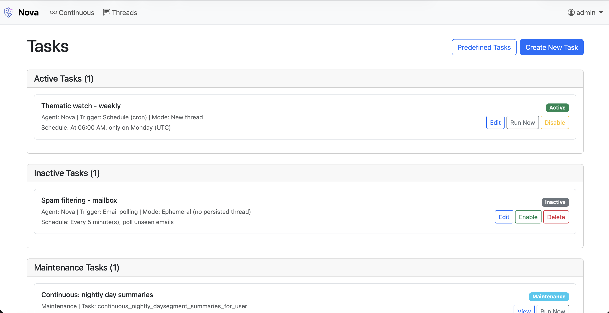
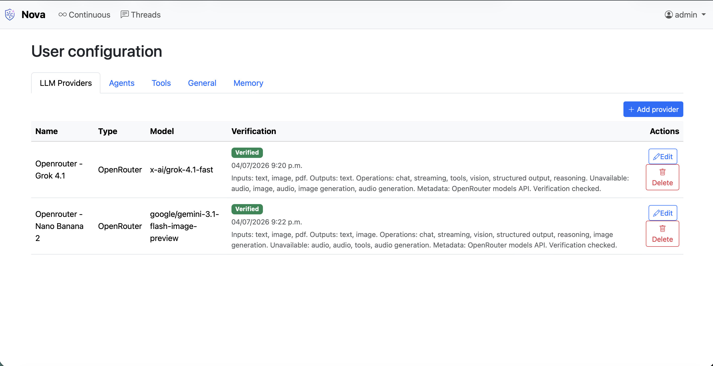
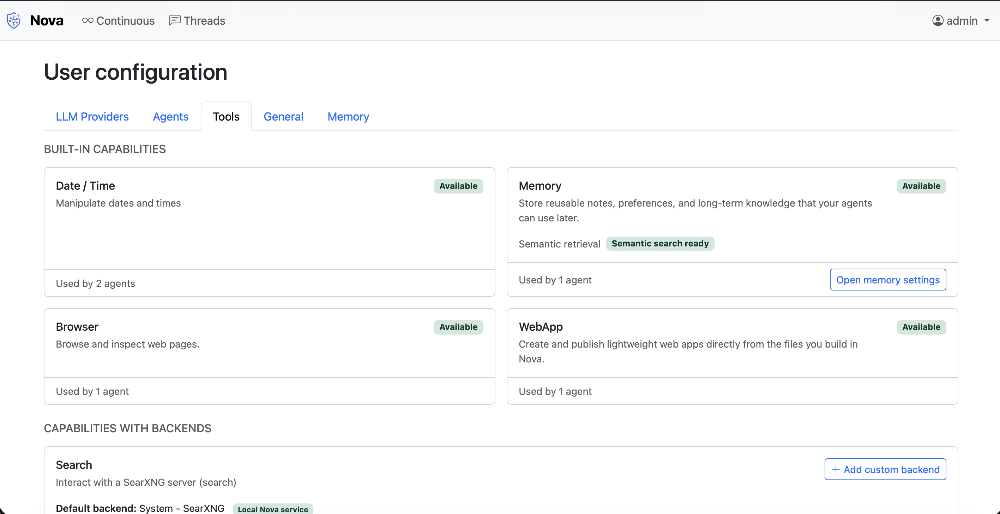
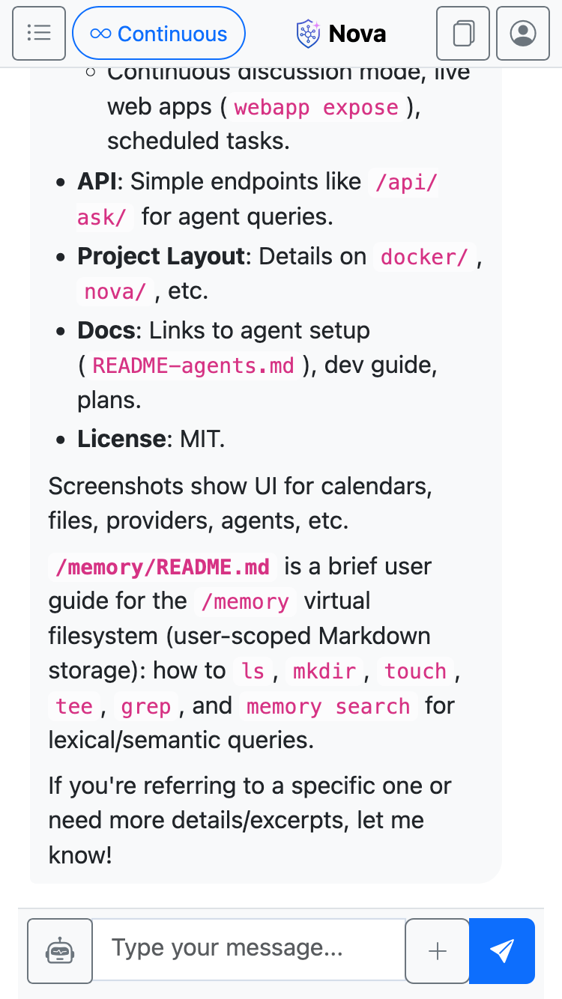

# Nova

[](https://github.com/AMairesse/Nova/actions/workflows/docker-image.yml)
[](https://github.com/AMairesse/Nova/actions/workflows/django.yml)

Nova is a privacy-first, multi-tenant AI agent workspace built around a persistent terminal-style runtime.

The product includes a desktop-first workspace, a mobile-friendly conversation UI, dedicated settings for providers, capabilities, and managed connections, plus an execution details view for understanding what happened during a run.



| | |
| --- | --- |
|  |  |
|  |  |

| | |
| --- | --- |
|  |  |


## Quickstart

```bash
git clone https://github.com/AMairesse/Nova.git
cd Nova/docker
cp .env.example .env
docker compose up -d
```

Open [http://localhost:8080](http://localhost:8080).

Default credentials:
- Username: `admin`
- Password: `changeme`

Optional services are enabled through `COMPOSE_FILE` in `docker/.env`.

Then configure your providers, capabilities/connections, and agents: [README-agents.md](README-agents.md).

## What Nova Provides

- A terminal-first agent runtime with a very small model tool surface:
  - `terminal(command: str)`
  - `delegate_to_agent(...)`
  - `ask_user(...)`
- Built-in capabilities such as Browser, Memory, WebApp, and Date/Time available by default
- Configurable connections and backends only where they are actually needed
- Persistent thread-scoped files plus runtime mounts such as `/inbox`, `/history`, `/memory`, and `/webdav`
- User-scoped long-term memory stored as Markdown documents and searched via chunks/embeddings
- Email, CalDAV, WebDAV, web search, browsing, MCP, and custom API integrations
- Continuous discussion mode with day summaries and history search/get commands
- Live thread-scoped static web apps published from normal workspace files
- Provider-aware model configuration, metadata refresh, and active verification
- Execution details with a readable overview, timeline, and technical drill-down
- A responsive UI that remains usable on mobile as well as desktop
- Scheduled tasks, email polling, and maintenance flows

## Key Capabilities

### Nova Runtime

Nova agents work through a persistent terminal-style mental model:

- normal file operations (`ls`, `cat`, `find`, `tee`, `mv`, `rm`, ...)
- current-message inputs under `/inbox` and earlier live-message attachments under `/history`
- specialized command families (`mail`, `calendar`, `memory search`, `webapp`, `mcp`, `api`, ...)
- delegated sub-agents that exchange files through `/subagents/...`
- blocking clarifications through `ask_user`

### Files and Memory

- Thread files are stored as `UserFile`
- `/memory` is a user-scoped virtual Markdown workspace backed by:
  - `MemoryDirectory`
  - `MemoryDocument`
  - `MemoryChunk`
  - `MemoryChunkEmbedding`
- Semantic lookup is done on chunks with `memory search`

### Continuous Mode

Nova supports:

- classic thread conversations
- one user-scoped continuous conversation with day segmentation, summaries, and recall

Continuous mode relies on stored messages, summaries, and embeddings.

### Integrations

Nova supports:

- built-in capabilities exposed through internal plugins
- backend-backed capabilities for search and Python, with deployment defaults when the matching deployment modules are enabled
- optional custom user backends for search
- MCP servers with optional managed OAuth
- custom API services defined through `APIToolOperation`
- optional deployment services such as SearXNG, `exec-runner`, Ollama, and llama.cpp when enabled in Docker

### Web Apps

Agents can publish live static apps from normal files:

- create/edit files in the workspace
- run `webapp expose <source_dir>`
- Nova serves the app under `/apps/<slug>/`

## API

Nova exposes a minimal authenticated API:

- `GET /api/`
- `GET /api/ask/`
- `POST /api/ask/`

`POST /api/ask/` runs your default agent through the same runtime on an ephemeral thread, then returns only the final answer.

Authentication uses DRF token auth:

```bash
curl -H "Authorization: Token YOUR_TOKEN_HERE" \
     -H "Content-Type: application/json" \
     --data '{"question":"Who are you and what can you do?"}' \
     http://localhost:8080/api/ask/
```

## Project Layout

```text
Nova
├─ docker/                # Docker stacks and runtime configuration
├─ nova/
│  ├─ api/                # REST API endpoints
│  ├─ continuous/         # Continuous-mode context, summaries, recall
│  ├─ models/             # One model per file
│  ├─ plugins/            # Internal plugin registry and builtin descriptors
│  ├─ providers/          # Provider adapters and capability logic
│  ├─ runtime/            # Nova runtime
│  ├─ tasks/              # Celery tasks and task templates
│  ├─ views/              # Django views
│  ├─ web/                # Search, browser, and download services
│  └─ webapp/             # Webapp publishing/serving
├─ user_settings/         # User configuration app
├─ plans/                 # Current architecture and product notes
├─ README-agents.md       # Agent setup guide
└─ README-dev.md          # Development guide
```

## Documentation Map

- [docker/README.md](docker/README.md): Docker stacks and environment configuration
- [README-agents.md](README-agents.md): provider/capability/connection/agent setup
- [README-dev.md](README-dev.md): repository structure and runtime internals
- [plans/react_terminal.md](plans/react_terminal.md): runtime architecture
- [plans/memory.md](plans/memory.md): long-term memory model
- [plans/continuous_discussion.md](plans/continuous_discussion.md): continuous mode behavior
- [plans/task_engine.md](plans/task_engine.md): task execution model

## License

Nova is released under the MIT License. See [LICENSE](LICENSE).

## Acknowledgements

- [Django](https://www.djangoproject.com/)
- [Django REST Framework](https://www.django-rest-framework.org/)
- [Django Channels](https://channels.readthedocs.io/)
- [Celery](https://docs.celeryq.dev/)
- [FastMCP](https://github.com/modelcontext/fastmcp)
- [Bootstrap 5](https://getbootstrap.com/)

## Troubleshooting

- Port conflicts: ensure `HOST_PORT` (default `8080`) is free
- Stack mismatch: after changing `COMPOSE_FILE`, run `docker compose up -d --remove-orphans`
- No superuser: ensure `DJANGO_SUPERUSER_*` is set in `docker/.env`
- Optional service missing in UI: check `COMPOSE_FILE` and related env vars
- Ollama connectivity: use `host.docker.internal` on Docker Desktop or your host IP on Linux
