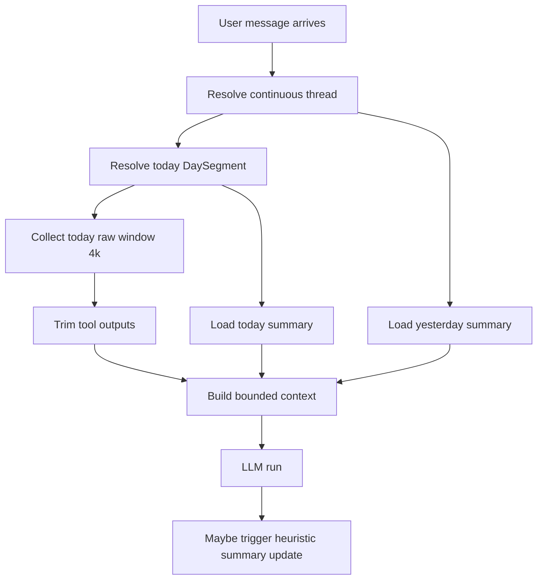
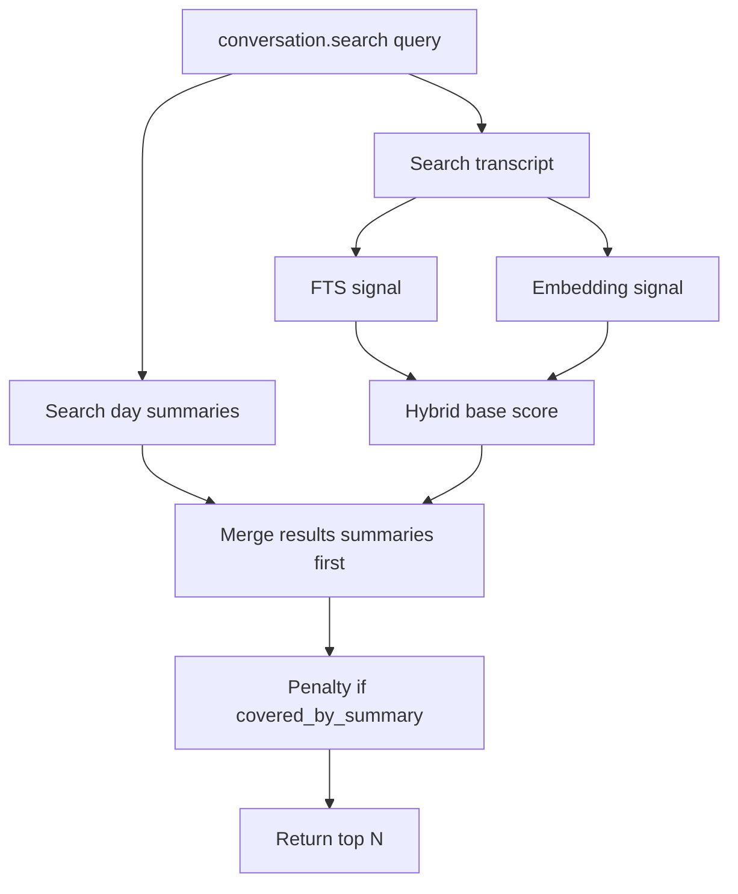
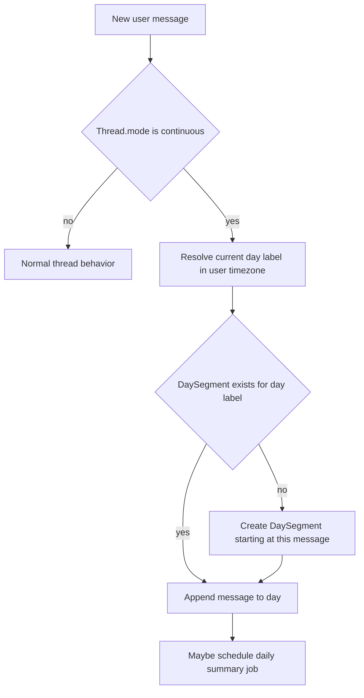
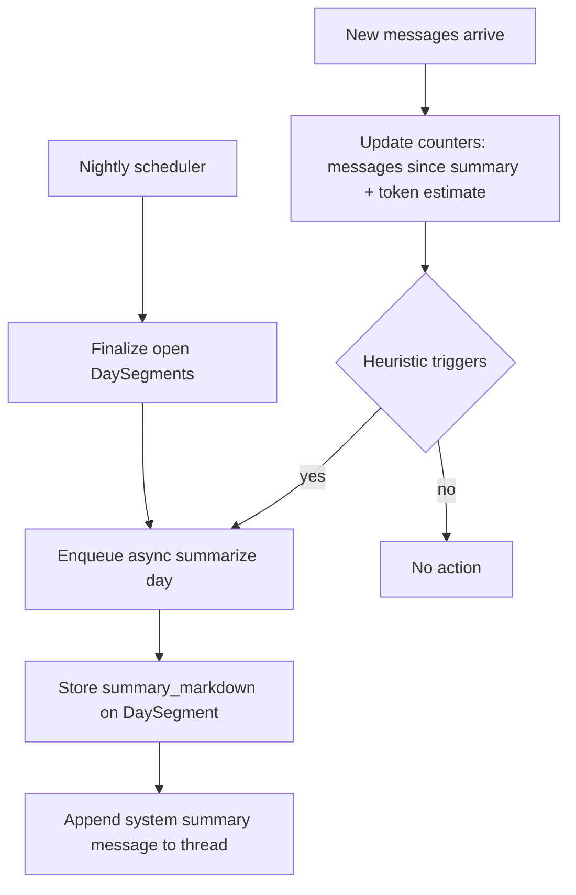

# Continuous Discussion Mode (Spec Draft)

## 0. Goal

Add a **continuous discussion mode** to Nova that:

- lets a user continue the same discussion across days without creating new threads
- keeps context **bounded** (no runaway prompts)
- remains compatible with the existing **thread-based** mode

This mode builds on the existing structured global memory (Memory v2) and adds **conversation-level recall** for the ongoing continuous thread.

## 1. Key concepts

We separate 3 layers:

1) **Transcript**: raw [`Message`](nova/models/Message.py:1) rows in the continuous [`Thread`](nova/models/Thread.py:1)
2) **Day segments**: visible daily grouping + summaries (new `DaySegment`)
3) **Global Memory v2**: durable user memory via [`memory.search()`](nova/tools/builtins/memory.py:207)

Principle:

- **Messages remain source of truth** (not deleted). Summaries are derived artifacts.

## 2. Decisions (V1 frozen)

### 2.1 One continuous thread per user

- V1: exactly **one** continuous thread per user (default entry point)

### 2.2 Visible day segments with boundary = first message of the day

- Day segments are based on user timezone.
- A new day segment is opened on the **first message of that calendar day**.

Implication:

- a late-night session is not split exactly at midnight; it is grouped more naturally.

### 2.3 Default agent context in continuous mode

Default context payload (bounded):

- **Today raw window**: token budget 4k, with aggressive trimming of tool outputs
- **Today summary**: hybrid Markdown summary
- **Yesterday summary**: short Markdown summary
- Tool hints and policy (how to use memory and conversation tools)

Everything older is retrieved via `conversation.search` / `conversation.get`.

### 2.4 Conversation tools: search + get

V1 exposes two tools:

- `conversation.search` (summaries-first, then transcript)
- `conversation.get` (fetch exact content by message id or by range)

### 2.5 conversation.search scope (V1)

V1 search scope:

- **summaries + transcript FTS + embeddings** (when embeddings enabled)
- summaries-first + transcript still searchable
- slight penalty for transcript hits that are already covered by a summary

### 2.6 Summary format and storage

- Summary format: **hybrid** (narrative + fixed sections)
- Storage: **Markdown block only**
- Generation: dedicated summarization prompt triggered by Nova (async job)

Suggested Markdown template:

```md
## Summary
<short narrative>

## Goals
- ...

## Decisions
- ...

## Open loops
- ...

## Next steps
- ...
```

### 2.7 Summaries also visible as system messages

We want the web UI to show compaction results clearly.

- `DaySegment.summary_markdown` is persisted for retrieval
- a corresponding **system message** is appended in the thread so the user can see when compaction happened

Messaging apps note:

- external apps cannot insert historical system messages; the web UI can.

### 2.8 Sub-agents are stateless and cannot call conversation tools

- Sub-agents do not keep persistent continuous context
- `conversation.search/get` are reserved to the main agent (V1)

## 3. UX text mockups (web)

This section is intentionally “ASCII UI” to validate the experience.

### 3.1 Main screen (continuous)

```
[Nova]

Top nav:  Continuous   Threads   Settings

Continuous
  Agent: Nova (default)

  Day selector: [Today ▼] [Yesterday] [Pick date]

  Search: [____________________] [Scope: Day ▼] [Go]

------------------------------------------------------------
Day Summary (Today)                      [Regenerate summary]

Summary
We continued designing the continuous discussion mode...

Goals
- Finalize tool surface and context policy

Decisions
- Day boundary is first message of the day

Open loops
- Define transcript chunking for embeddings

Next steps
- Spec conversation.search/get schemas
------------------------------------------------------------

Timeline (Today)

09:05  User:   On avance sur les segments journaliers.
09:06  Agent:  Ok, voici les options...

10:12  System: Day summary updated
       [content folded by default ▸ expand]

10:13  User:   Et pour conversation.search ?
10:14  Agent:  V1: summaries + transcript FTS + embeddings...

[Type message…____________________________________] [Send]
```

### 3.2 Switching days

```
Day selector: [2026-01-29 ▼]

Timeline (2026-01-29)

  [Older messages folded ▸]

  18:10 System: Day summary finalized
        (shows the daily summary block)

  18:11 User/Agent messages...
```

### 3.3 Search in continuous mode

```
Search: [statut______________] [Scope: Day ▼] [Go]

Results

1) kind: summary   day: 2026-01-31   score: 0.78
   snippet: "Open loops: définir chunking embeddings..."
   action: [Open]

2) kind: message   day: 2026-01-31   score: 0.62   covered_by_summary: yes
   snippet: "...on mettra une pénalité légère..."
   action: [Open]
```

Where:

- “Open” calls `conversation.get` to fetch exact text for grounding.

### 3.4 Collapsing behavior after compaction (what the user sees)

Goal: when a compaction/summarization happens mid-day, the UI should make it obvious.

```
Timeline (Today)

  [Older messages folded ▸]    (these are now represented by the summary)

  14:32 System: Day summary updated
        [expand to read the summary]

  14:33 User:  Ok, continue.
  14:34 Agent: ...
```

In other words: we do not delete old messages, but we fold them in the UI once a summary has covered them.

## 4. Context and compaction behavior

### 4.1 Raw window budget (today)

- Budget: **4k tokens** for the “today raw” window.

Trimming priorities:

1) keep user+assistant natural language messages
2) trim tool outputs first (head/tail + placeholder)
3) drop oldest raw turns from today if still too large

### 4.2 Summary update triggers

Two mechanisms:

1) **Daily automatic summary**
   - when first message creates a new day segment, schedule a daily job to produce/update today summary
2) **Heuristic in-day summary**
   - async trigger when:
     - 10 new messages since last summary, OR
      - token pressure detected (near limit)

### 4.4 Messaging app integration note (WhatsApp, Signal, ...)

In a messaging app, we cannot insert a “system summary message” back in time.

Guideline:

- The web UI remains the source of truth for summary visibility.
- The messaging adapter can:
  - ignore system summary messages entirely, or
  - post a summary forward as a new assistant message (if we explicitly want users to see it in the external app).

### 4.3 Transcript lifecycle vs summary

- Messages persist (source of truth).
- Summaries are derived artifacts.
- Transcript remains searchable even if content is covered by a summary.

## 5. Tool spec (draft V1)

### 5.1 `conversation.search`

Input:

- `query` string
- `day` optional `YYYY-MM-DD`
- `recency_days` optional
- `limit` int default 6 max 20
- `min_score` optional float

Output:

- `results`: list of
  - `kind`: `summary|message`
  - `day_label`
  - `day_segment_id`
  - if `kind=message`:
    - `message_id`
    - `snippet`
    - `covered_by_summary` bool
    - `score`
  - if `kind=summary`:
    - `summary_snippet`
    - `score`

Ranking:

- summaries-first merge
- base score is hybrid (vector dominant + lexical assist)
- apply penalty when `covered_by_summary=true` (suggested multiplier 0.85)
- tie-breakers: newer day, then newer message

Notes:

- This mirrors the “hybrid 70/30” idea used in Clawdbot, but V1 should keep the exact coefficients configurable.
- If embeddings are disabled, transcript search falls back to FTS-only.

### 5.2 `conversation.get`

Input (one-of):

- `message_id`
- `day_segment_id`
- `day_segment_id` + `from_message_id` + `to_message_id`

Output:

- if messages: ordered list of `{message_id, role, content, created_at}`
- if summary: `{day_segment_id, day_label, summary_markdown, updated_at}`

## 6. Prompt policy (avoid cannibalization)

Rule set (V1):

- Durable fact / preference / long-term instruction → use [`memory.search()`](nova/tools/builtins/memory.py:207)
- Ongoing-thread detail across days → use `conversation.search/get`
- Never copy raw transcript into long-term memory automatically; use [`memory.add()`](nova/tools/builtins/memory.py:77) only when explicitly asked or clearly durable and non-sensitive

## 7. Data model (V1 draft)

### 7.1 Thread mode

Add a marker to [`Thread`](nova/models/Thread.py:1):

- `mode`: `thread|continuous`

Constraint:

- enforce at application layer: one `mode=continuous` thread per user

### 7.2 `DaySegment`

New model (location suggestion: [`nova/models/DaySegment.py`](nova/models/DaySegment.py:1)):

- `user` FK
- `thread` FK
- `day_label` date
- `starts_at_message` FK → `Message`
- `ends_at_message` FK → `Message` nullable
- `summary_markdown` text
- `updated_at`

Indexes:

- unique `(user_id, thread_id, day_label)`

### 7.3 Derived indexes for transcript search (to specify)

We will need derived structures for:

- FTS over transcript
- embeddings over transcript chunks

This will likely mirror Memory v2 patterns but scoped to the continuous thread/day segments.

## 8.1 Open design point: transcript chunking for embeddings (V1)

We must avoid indexing per-token/per-message with excessive volume.

Candidates:

- Chunk per message (simplest, can be noisy/short)
- Chunk by window of messages (e.g. group contiguous messages into ~400–800 token blocks with overlap)
- Chunk by turn-pairs (user+assistant)

Recommendation for V1: group by contiguous windows to reduce index cardinality, with provenance back to message ids.

## 8. Mermaid diagrams

### 8.1 Agent run context build



### 8.2 conversation.search flow



### 8.3 Day segment creation flow



### 8.4 Summary update flow (daily + heuristic)



## 9. Next steps

Remaining spec work:

- finalize transcript indexing tables and chunking strategy
- specify Celery tasks precisely (nightly summary + heuristic update) and failure handling
- map UI changes into Django views/templates and endpoints

Suggested next question to settle before implementation:

- Do we want a dedicated UI affordance to “promote” a conversation excerpt into Memory v2 (user-confirmed), or keep it manual via chat instruction only?
