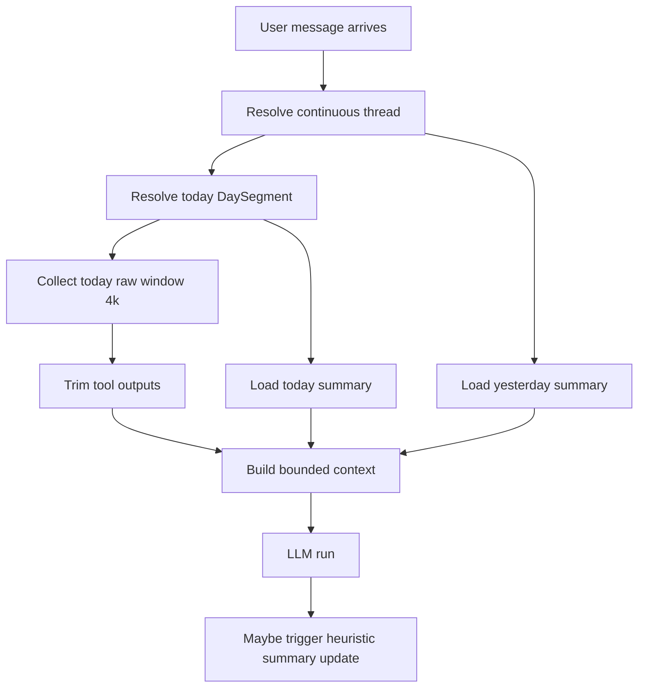
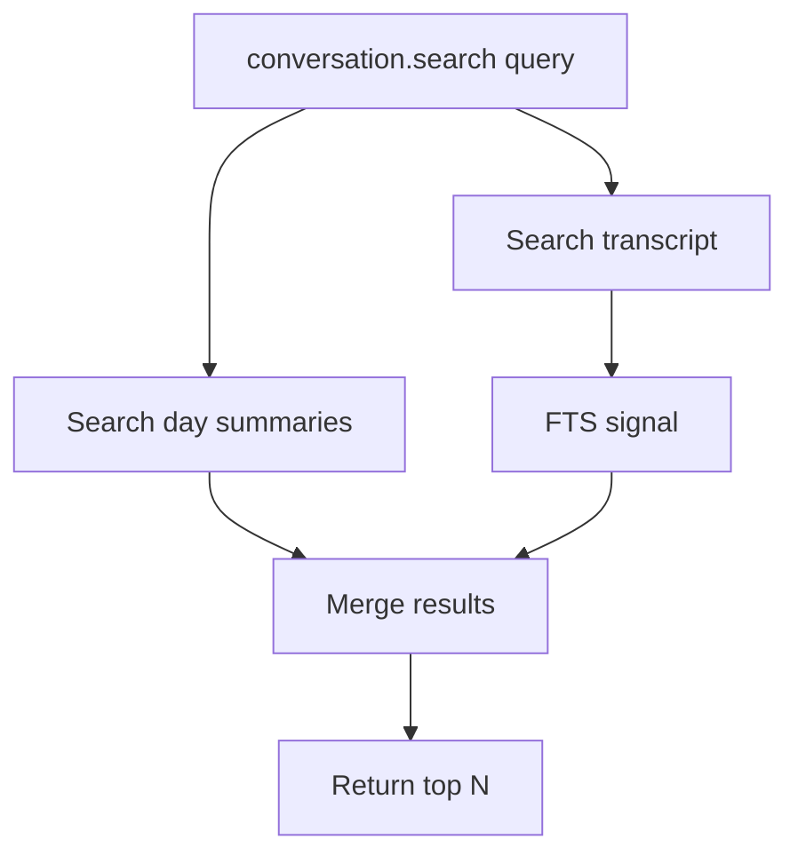
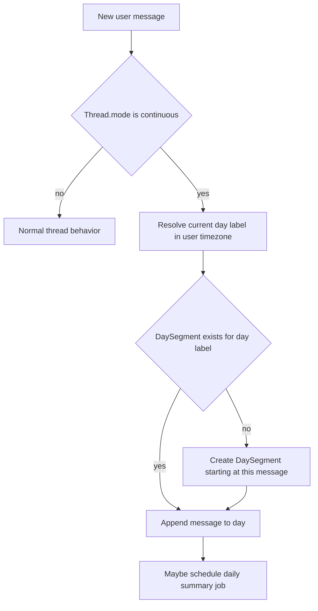
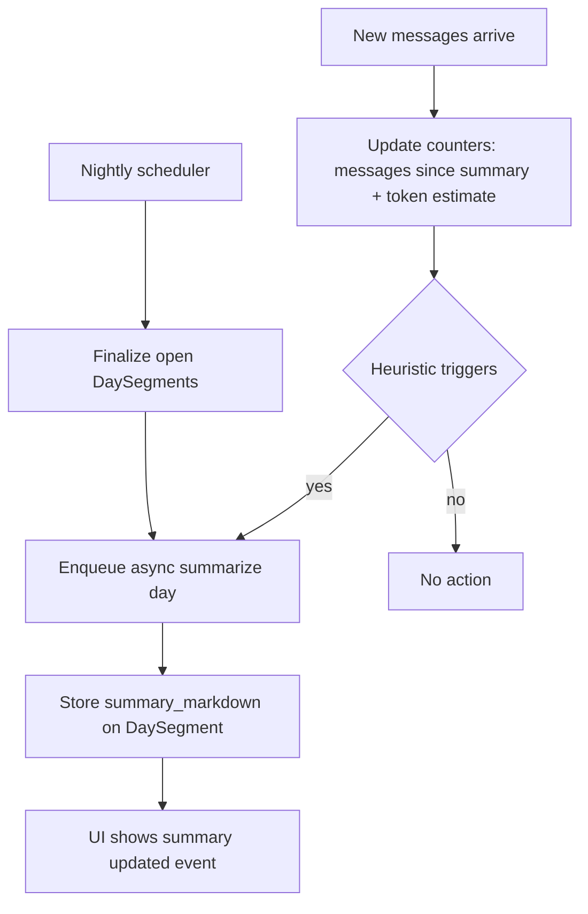
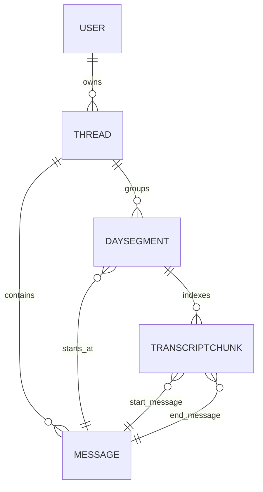

# Continuous Discussion Mode (Spec)

## 0. Goal

Add a **continuous discussion mode** to Nova that:

- lets a user continue the same discussion across days without creating new threads
- keeps context **bounded**
- coexists with the existing **thread-based** mode

This mode complements global long‑term memory (`memory.*`) with **conversation‑level recall** for the single ongoing continuous thread.

## 1. Core concepts (V1)

We separate 3 layers:

1) **Transcript**: raw [`Message`](nova/models/Message.py:1) rows in the continuous [`Thread`](nova/models/Thread.py:1)
2) **Day segments**: visible daily grouping + a summary (new `DaySegment`)
3) **Memory Tool**: durable user memory via `memory.search()`

Principle:

- **Messages are the source of truth** (not deleted). Summaries are derived artifacts.

## 2. Product decisions (V1)

### 2.1 One continuous thread per user

- Exactly **one** continuous thread per user.

### 2.2 Day segments: boundary = first message of the day

- Day segments are based on **user timezone**.
- A new day segment is opened on the **first message of that calendar day**.

### 2.3 Default agent context in continuous mode (bounded)

Default context payload:

- **Today raw window**: target budget **4k tokens**, with aggressive trimming of tool outputs
- **Today summary**: Markdown
- **Yesterday summary**: Markdown
- Tool hints/policy (how to use `memory.*` vs `conversation.*`)

Anything older is retrieved on-demand via `conversation.search` / `conversation.get`.

### 2.4 Conversation tools

We expose two tools allowing the agent to read previous messages or summaries:

- `conversation.search`
- `conversation.get`

Scope (V1):

- **day summaries + transcript**
- **lexical search only** (PostgreSQL FTS)

### 2.5 Summary format and storage

- Summary format: **Markdown** using a fixed template.
- Storage: `DaySegment.summary_markdown`.
- Generation: async job (Celery task) triggered by Nova.

Suggested Markdown template:

```md
## Summary
<short narrative>

## Goals
- ...

## Decisions
- ...

## Open loops
- ...

## Next steps
- ...
```

### 2.6 Summary updates (V1)

We keep summary updates intentionally simple:

- **Automatic**: when a new day starts (first message of the day), Nova finalizes/summarizes the **previous day**.
- **Manual**: user can click “Regenerate summary” for the currently selected day.

No additional “in‑day heuristics” in V1.

### 2.7 UI visibility of summary updates

- No `system` [`Message`](nova/models/Message.py:1) is persisted for summary updates.
- UI can display a lightweight “Day summary updated” event derived from `DaySegment.updated_at`.

### 2.8 Sub-agents policy

- Sub-agents are stateless and **cannot** call `conversation.search/get`.
- `conversation.search/get` are reserved to the main agent.

## 3. UX text mockups (web)

This section is intentionally “ASCII UI” to validate the experience.

### 3.1 Main screen (continuous)

```
[Nova]

Top nav:  Continuous   Threads   Settings

Continuous
  Agent: Nova (default)

  Day selector: [Today ▼] [Yesterday] [Pick date]

  Search: [____________________] [Scope: Day ▼] [Go]

------------------------------------------------------------
Day Summary (Today)                      [Regenerate summary]

Summary
We continued designing the continuous discussion mode...

Goals
- Finalize tool surface and context policy

Decisions
- Day boundary is first message of the day

 Open loops
 - Define transcript chunking parameters (token target + overlap)

Next steps
- Spec conversation.search/get schemas
------------------------------------------------------------

Timeline (Today)

09:05  User:   On avance sur les segments journaliers.
09:06  Agent:  Ok, voici les options...

  10:12  UI: Day summary updated
        (summary panel refreshed)

10:13  User:   Et pour conversation.search ?
  10:14  Agent:  day summaries + transcript chunks (FTS)...

[Type message…____________________________________] [Send]
```

### 3.2 Switching days

```
Day selector: [2026-01-29 ▼]

Timeline (2026-01-29)

  [Older messages folded ▸]

  18:10 UI: Day summary updated
        (summary panel refreshed)

  18:11 User/Agent messages...
```

### 3.3 Search in continuous mode

```
Search: [statut______________] [Scope: Day ▼] [Go]

Results

1) kind: summary   day: 2026-01-31   score: 0.78
   snippet: "Open loops: définir chunking embeddings..."
   action: [Open]

2) kind: message   day: 2026-01-31   score: 0.62   covered_by_summary: yes
    snippet: "...on mettra une pénalité légère..."
    action: [Open]
```

Where:

- “Open” calls `conversation.get` to fetch exact text for grounding.

Notes (V1 simplification):

- Search results do **not** include `covered_by_summary`. The UI remains the same; we keep the results list minimal.
- “Open” still calls `conversation.get` to fetch exact text for grounding.

UI note:

- The mockup line `covered_by_summary: yes` is illustrative only; it is not part of the V1 tool output.

### 3.4 Collapsing behavior after compaction (what the user sees)

Goal: when a compaction/summarization happens mid-day, the UI should make it obvious.

```
Timeline (Today)

  [Older messages folded ▸]    (these are now represented by the summary)

  14:32 UI: Day summary updated
        [expand summary panel]

  14:33 User:  Ok, continue.
  14:34 Agent: ...
```

In other words: we do not delete old messages, but we fold them in the UI once a summary has covered them.

V1 folding rule (simplified):

- Folding is **purely UI-based** and uses timestamps.
- When `DaySegment.updated_at` changes (summary regenerated), the UI may fold messages with `created_at <= DaySegment.updated_at` under “Older messages folded”.
- This is a visual aid only; it does not need a stored message-id boundary.

## 4. Context and trimming (V1)

### 4.1 Raw window budget (today)

- Budget: **4k tokens** for the “today raw” window.

Trimming priorities:

1) keep user+assistant natural language messages
2) trim tool outputs first (head/tail + placeholder)
3) drop oldest raw turns from today if still too large

### 4.2 Summary update triggers

Two mechanisms (V1):

1) **Day rollover**: when a new day starts, schedule a job to summarize **yesterday**.
2) **Manual**: user triggers “Regenerate summary”.

### 4.3 Transcript lifecycle vs summary

- Messages persist (source of truth).
- Summaries are derived artifacts.
- Transcript remains searchable even if content is covered by a summary.

## 5. Tool spec (V1)

### 5.1 `conversation.search`

Input:

- `query` string
- `day` optional `YYYY-MM-DD` (if provided, restricts to that day)
- `limit` int (default 6, max 50)
- `offset` int (default 0, max 500)

Output:

- `results`: list of
  - `kind`: `summary|message`
  - `day_label`
  - `day_segment_id`
  - if `kind=message`:
    - `message_id` (representative id, typically the first message in the matched chunk window)
    - `snippet`
    - `score`
  - if `kind=summary`:
    - `summary_snippet`
    - `score`

- `total_estimate` optional int (best-effort; can be omitted)

Notes:

- Transcript search may be implemented on derived artifacts (for example transcript chunks) rather than scanning raw [`Message`](nova/models/Message.py:1) rows. The tool output exposes a stable `message_id` anchor.
- For exact quoting/grounding, follow up with [`conversation.get`](plans/continuous_discussion.md:1) using that `message_id`.

Ranking (V1):

- FTS score ordering; tie-break by recency.

### 5.2 `conversation.get`

Input (one-of):

- `message_id` (anchor)
- `day_segment_id` (fetch the day summary)

Pagination + limits (for message retrieval):

- `limit` optional (default 30, max 30)
- `before_message_id` optional
- `after_message_id` optional

Rules:

- `message_id` returns a window around the message.
- `before_message_id` / `after_message_id` allow simple paging.

Output:

- if messages: ordered list of `{message_id, role, content, created_at}`
- if summary: `{day_segment_id, day_label, summary_markdown, updated_at}`

Output additions:

- `next_before_message_id` / `next_after_message_id` optional

Multi-tenant and permissions:

- `conversation.get` only returns content belonging to the current authenticated user
- any `message_id` / `day_segment_id` outside the user scope must return a not-found style error

## 6. Prompt policy (avoid cannibalization)

Rule set:

- Durable fact / preference / long-term instruction → use [`memory.search()`](nova/tools/builtins/memory.py:207)
- Ongoing-thread detail across days → use `conversation.search/get`
- Never copy raw transcript into long-term memory automatically; use [`memory.add()`](nova/tools/builtins/memory.py:77) only when explicitly asked or clearly durable and non-sensitive

## 7. Data model

### 7.1 Thread mode

Decision: model continuous discussion as a **Thread mode**.

- Add `Thread.mode` with at least: `thread|continuous`.
- Continuous home resolves the user’s continuous thread via:
  - `Thread.objects.get(user=user, mode='continuous')`
  - if missing: create it.

Correctness note:

- The request path must be idempotent (handle concurrent create attempts safely).
- We can later add a PostgreSQL partial unique index to enforce **at most one** `mode='continuous'` thread per user, without changing API semantics.

### 7.2 `DaySegment`

New model (location suggestion: [`nova/models/DaySegment.py`](nova/models/DaySegment.py:1)):

- `user` FK
- `thread` FK (the continuous thread)
- `day_label` date
- `starts_at_message` FK → `Message`
- `summary_markdown` text
- `updated_at`

Clarifications:

- `day_label` is computed using **user timezone**.
- `starts_at_message` is the **first message** that opened the day segment.

V1 simplification:

- We do not persist a “closed” marker (`ends_at_message`) in V1.
- We do not persist a “summary covers until message” boundary in V1 (folding is UI-based via `updated_at`).

Indexes:

- unique `(user_id, thread_id, day_label)`

Recommended additional indexes:

- `(user_id, thread_id, starts_at_message_id)`
- `(user_id, thread_id, day_label DESC)` for “latest day” lookups

Invariants:

- `starts_at_message.thread_id == DaySegment.thread_id`

V1 note:

- Fields like `ends_at_message` and `summary_covers_until_message` do not exist in V1, so no invariants are defined for them.

Update rules (V1):

- On day creation, set `starts_at_message` to the triggering message.
- On any summary update (heuristic / daily / manual): update `summary_markdown` and `updated_at`.

### 7.3 Transcript indexing (FTS)

We need a searchable representation of the transcript for `conversation.search`.

V1: lexical only (FTS). No embeddings.

#### 7.3.1 `TranscriptChunk` (recommended minimal approach)

Plain-language definition:

- A `TranscriptChunk` is a **small slice of the continuous conversation transcript**, built by concatenating several consecutive messages into one searchable document.
- It exists because searching the raw [`Message`](nova/models/Message.py:1) table directly is often too granular (too many rows).
- It is the **unit of retrieval** for `conversation.search` on the transcript side.

Key properties (V1):

- A chunk stores `start_message_id` and `end_message_id` so we can fetch exact raw turns with [`conversation.get`](plans/continuous_discussion.md:1).
- Tool outputs are trimmed so the chunk represents the “human conversation” more than logs.

We index the transcript via **chunk windows** (not per message) to control volume.

New model suggestion: [`nova/models/TranscriptChunk.py`](nova/models/TranscriptChunk.py:1)

- `user` FK
- `thread` FK (the continuous thread)
- `day_segment` FK (optional but recommended for fast day-scoped search)
- `start_message` FK → [`Message`](nova/models/Message.py:1)
- `end_message` FK → [`Message`](nova/models/Message.py:1)
- `content_text` (normalized concatenation of included message contents; tool outputs trimmed)
- `content_hash` (dedupe + idempotence)
- `token_estimate` (for budgeting and diagnostics)
- `created_at`
- `updated_at`

Clarifications:

- A chunk represents an **ordered contiguous window** of messages within a single day segment.
- A chunk is the unit for transcript search (FTS + embeddings) and returns provenance via `start_message_id/end_message_id`.

Chunk construction (V1):

- include `user` + `assistant` messages
- exclude `system` messages
- heavily trim tool payloads/results

Indexes/constraints:

- unique `(user_id, thread_id, start_message_id, end_message_id)`
- index `(user_id, thread_id, day_segment_id, start_message_id)`

Recommended additional indexes:

- `(user_id, thread_id, end_message_id)` to map a message id to candidate chunks
- if day-scoped searches are common: `(user_id, day_segment_id)`

Invariants:

- `start_message.thread_id == TranscriptChunk.thread_id`
- `end_message.thread_id == TranscriptChunk.thread_id`
- `start_message_id <= end_message_id`

Additional invariants:

- `day_segment.thread_id == TranscriptChunk.thread_id`
- `start_message.created_at` and `end_message.created_at` fall within the day segment’s effective window

`content_hash`:

- deterministic hash of the normalized `content_text` + boundary ids
- used to make chunk computation idempotent for retries

Update model (V1):

- append-only

Idempotence:

- enforce uniqueness via `(user_id, thread_id, start_message_id, end_message_id)`
- `content_hash` is used to detect “no-op” updates when retrying

FTS:

- store a materialized `tsvector` column (or compute via functional index)
- language config should follow current project defaults (to confirm)

Notes:

- We keep transcript search artifacts **scoped to the continuous thread** (not global).
- Retention: V1 keeps all chunks (messages are source-of-truth anyway).

#### 7.3.2 Summary indexing (V1)

- add an FTS index on `DaySegment.summary_markdown`

V1 intentionally excludes embeddings for summaries and transcript.

### 7.5 Lexical search (FTS) strategy

We use PostgreSQL full-text search (FTS) as the lexical signal for `conversation.search`.

#### 7.5.1 What is indexed

1) **Summaries**

- `DaySegment.summary_markdown`
- recommended: add a `tsvector` column (materialized) or a functional index over `to_tsvector(...)`

2) **Transcript**

- `TranscriptChunk.content_text`
- recommended: add a `tsvector` column (materialized) or a functional index

Rationale:

- `DaySegment` gives low-volume, high-signal summary search
- `TranscriptChunk` enables exact-detail lexical retrieval without scanning raw [`Message`](nova/models/Message.py:1)

#### 7.5.2 Language configuration

Decision:

- use the same `to_tsvector` config as Memory v2 / current implementation: `english`.

#### 7.5.3 Ranking signal and normalization

We need the lexical score normalized to 0..1 to keep scoring stable.

V1 approach (simple + stable):

- compute `fts_raw` using `ts_rank_cd(tsvector, plainto_tsquery(...))` (or `websearch_to_tsquery` if you want richer parsing)
- normalize by a saturating transform:
  - `fts = fts_raw / (fts_raw + 1)`

Notes:

- this avoids needing corpus-wide min/max per query
- keeps the combined score stable across different days/users

#### 7.5.4 Query parsing

Decision:

- `plainto_tsquery` for safety and predictable behavior.

#### 7.5.5 Indexing and updates

- On `DaySegment.summary_markdown` update:
  - update the `summary_tsv` field (if materialized)
- On `TranscriptChunk` creation/update:
  - update the `content_tsv` field (if materialized)

## 8. Celery workflows (V1)

This section specifies the async jobs required for continuous discussion mode.

### 8.1 Goals

- produce and refresh day summaries (nightly + in-day)
- keep transcript indexing up-to-date (chunks + FTS)
- ensure idempotence and safe concurrency
  - provide observability: user-visible UI events + task logs

### 8.2 Task inventory

Suggested task module: [`nova/tasks/conversation_tasks.py`](nova/tasks/conversation_tasks.py:1)

1) `ensure_continuous_thread(user_id)`
   - resolves/creates the user’s continuous [`Thread`](nova/models/Thread.py:1) (`Thread.mode='continuous'`)
   - should be callable from request path but implemented as an idempotent helper

2) `ensure_day_segment(user_id, thread_id, day_label)`
   - idempotently creates the [`DaySegment`](nova/models/DaySegment.py:1) if missing
   - sets `starts_at_message` on creation

3) `summarize_day_segment(day_segment_id, mode)`
    - `mode`: `rollover|manual`
   - builds summarization input:
     - messages from `starts_at_message` to current end (or latest message if open)
     - trims tool outputs aggressively
     - may include previous summary as context to make summarization incremental
    - writes:
      - `DaySegment.summary_markdown`
    - no transcript message is created; the UI shows the updated summary panel

4) `index_transcript_append(day_segment_id, from_message_id)`
    - creates new [`TranscriptChunk`](nova/models/TranscriptChunk.py:1) rows for messages after `from_message_id`
    - should be lightweight and safe to run frequently

5) Optional: a periodic job can backfill missed rollovers.

### 8.3 Trigger points

#### 8.3.1 On each new user message (continuous mode)

- resolve continuous thread and today day segment
- enqueue lightweight tasks:
  - `index_transcript_append(day_segment_id, last_indexed_message_id)`

- if the message opens a **new day**, enqueue summarization for the **previous day**.

#### 8.3.2 Periodic safety net (optional)

- A low-frequency periodic job may reconcile/summarize missing previous-day summaries.

### 8.4 Idempotence + concurrency control

Principles:

- tasks are safe to retry
- only one summarization or recompute runs at a time per `(user_id, day_segment_id)`

Locking strategy (V1):

- keep it simple: rely on task retries + uniqueness constraints for `TranscriptChunk`
- for summaries, last-write-wins on `DaySegment.summary_markdown` is acceptable for V1

### 8.5 Failure handling + retries

- summarization failures:
  - retry with exponential backoff (limited)
  - if still failing, keep last known summary and append an internal error log (not a user-visible message)
- indexing failures:
  - safe to retry; worst case search coverage is delayed

### 8.6 Observability

User-visible:

- UI event “Day summary updated” rendered using `DaySegment.updated_at` (no persisted transcript message)

Internal:

- Celery task status stored in existing task tracking (if present) and logged
- include `day_segment_id`, `thread_id`, `start/end message ids`, and token estimates in logs

## 9. Transcript chunking (V1)

We avoid indexing per-message to keep search volume reasonable.

Decision (V1): chunk the transcript into contiguous windows of messages (append-only). Exact chunk sizing is an implementation detail.

## 10. Mermaid diagrams

### 10.1 Agent run context build



### 10.2 conversation.search flow



### 10.3 Day segment creation flow



### 10.4 Summary update flow (daily + heuristic)



### 10.5 Data model ERD



Notes:

- Cardinalities are conceptual; actual DB constraints are via FK/OneToOne + unique indexes.
- All entities are user-scoped (multi-tenant). The `user` FK is included even when `thread` exists to make filtering and indexes explicit.

## 11. UI + endpoints mapping

Decision: add a dedicated continuous page at route `continuous/`, and keep the existing thread-based home page unchanged.

### 11.1 Routes

Add new server-rendered views:

- `GET continuous/` → render continuous home (day selector + day summary + timeline)
- `POST continuous/search/` (HTMX) → run `conversation.search` and render results fragment
- `GET continuous/messages/` (HTMX) → fetch message window around `message_id` (wraps `conversation.get`)
- `POST continuous/add-message/` (HTMX) → append a user message into the continuous thread and start agent execution (Celery task)
- `POST continuous/regenerate-summary/` (HTMX) → manual trigger: enqueue `summarize_day_segment(mode=manual)`

### 11.7 Real-time streaming

Decision:

- Reuse the existing WebSocket + Celery task progress pipeline (same consumer pattern as thread mode).

Expected flow (continuous):

1) User submits `POST continuous/add-message/`
2) View appends the user message in the backing continuous `Thread` (`Thread.mode='continuous'`).
3) View enqueues the existing agent execution task (same as thread mode), passing:
   - `thread_id` = continuous thread id
   - `agent_config` = default agent
4) Frontend connects to the same WebSocket channel used for task progress (see [`nova/routing.py`](nova/routing.py:1))
5) UI updates as events arrive (tool calls, streaming tokens, final assistant message)

Notes:

- Continuous mode should not introduce a new streaming mechanism (no SSE).
- Only routing and thread resolution differ; task tracking and WebSocket infra stay the same.

### 11.8 Day selector

Goal:

- allow the user to navigate day segments in the continuous thread quickly
- default to Today

UI controls:

- Quick picks:
  - `Today`
  - `Yesterday`
- Date picker:
  - calendar date input (opens a specific `day_label`)
- Optional dropdown:
  - shows the most recent N day segments (N=30) with a “Load more” action

Data source:

- list is derived from [`DaySegment`](nova/models/DaySegment.py:1) rows for the continuous thread.

Recommended endpoint:

- `GET continuous/days/` (HTMX fragment)
  - returns a list of available day segments, ordered by `day_label DESC`
  - supports offset pagination (or “load more” based on last day)

How to compute Today/Yesterday:

- use **user timezone** (same rule as day segments)
- Today = current local date
- Yesterday = Today - 1 day

Open-day behavior:

- If Today has no DaySegment yet, it is created on first message; until then the UI can show an empty timeline with “No messages yet today”.

Loading a selected day:

- changing day triggers a refresh of:
  - day summary block
  - timeline block
  - search scope default (Day)

## 12. Implementation checklist

This is an execution-oriented checklist to implement the spec.

### 12.1 Data model + migrations

- Add/extend [`Thread`](nova/models/Thread.py:1) with `mode` field.
- Add model [`DaySegment`](nova/models/DaySegment.py:1)
- Add model [`TranscriptChunk`](nova/models/TranscriptChunk.py:1)
    - include `content_text`, `content_hash`, `token_estimate`
    - exclude `system` messages from chunk content
- Add indexes:
  - unique `(user_id, thread_id, day_label)` on DaySegment
  - unique `(user_id, thread_id, start_message_id, end_message_id)` on TranscriptChunk
  - FTS indexes/columns for `DaySegment.summary_markdown` and `TranscriptChunk.content_text`

Notes:

- `Thread.mode` must be added and migration must ensure default mode for existing rows.

### 12.2 Tools: `conversation.search` + `conversation.get`

- Implement tool handler(s) following the schemas in:
  - [`conversation.search`](plans/continuous_discussion.md:376)
  - [`conversation.get`](plans/continuous_discussion.md:466)
- Enforce user-scoping (multi-tenant) and not-found semantics
- Implement scoring: FTS-only + simple recency multiplier
- Implement pagination for `conversation.search`: `offset` + `limit`

### 12.3 Indexing pipelines

- Implement chunking:
  - append-only in-day chunk creation
- Implement FTS updates for summary + chunks (config `english` to match current Memory v2)

### 12.4 Celery workflows

- Create task module [`nova/tasks/conversation_tasks.py`](nova/tasks/conversation_tasks.py:1)
- Implement tasks listed in [`Celery workflows`](plans/continuous_discussion.md:234)
- (Optional) periodic safety-net reconciliation job

### 12.5 Views + templates (web UI)

- Add routes described in [`UI + endpoints mapping`](plans/continuous_discussion.md:1063)
  - `GET continuous/`
  - `POST continuous/add-message/` (HTMX)
  - `POST continuous/search/` (HTMX)
  - `GET continuous/messages/` (HTMX)
  - `POST continuous/regenerate-summary/` (HTMX)
  - `GET continuous/days/` (HTMX)
- Templates:
  - `nova/templates/nova/continuous/index.html`
  - partials for day selector, day summary, timeline, search results, message window
- Folding:
  - fold messages using timestamps (UI-based) as described in [`3.4 Collapsing behavior after compaction`](plans/continuous_discussion.md:188)
- Agent selection:
  - no selection in V1; always resolve user default agent
- Streaming:
  - reuse existing WebSocket task progress pipeline (see [`nova/routing.py`](nova/routing.py:1))

### 12.6 Tests

- Model tests:
   - Thread.mode continuous get-or-create logic
   - DaySegment invariants
   - TranscriptChunk chunk boundary and idempotence (`content_hash`)
- Tool tests:
  - `conversation.search` scoring + pagination + user scoping
  - `conversation.get` windowing (`limit`, `before_message_id`, `after_message_id`, truncation)
- Task tests:
   - nightly finalize triggers summary
   - heuristic triggers schedule summary updates

### 12.7 Rollout notes

- Initial backfill:
  - on first visit to `continuous/`, lazily create the continuous Thread and DaySegment on first message
- Observability:
  - ensure the summary panel and the “Day summary updated” UI event are visible

Notes:

- We should keep existing endpoints like [`add_message`](nova/views/thread_views.py:221) for thread mode, but introduce a continuous-specific message posting endpoint to avoid mixing semantics.

### 11.2 Templates

Suggested new templates (names indicative):

- `nova/templates/nova/continuous/index.html`
- `nova/templates/nova/continuous/partials/day_selector.html`
- `nova/templates/nova/continuous/partials/day_summary.html`
- `nova/templates/nova/continuous/partials/timeline.html`
- `nova/templates/nova/continuous/partials/search_results.html`
- `nova/templates/nova/continuous/partials/message_window.html`

### 11.3 Navigation

- Top nav adds: `Continuous` linking to `continuous/`.
- Threads mode remains accessible via existing navigation.

### 11.3.1 Agent selection

Decision:

- No agent selection UI in continuous mode.
- Continuous mode always uses the user’s **default agent**.

Implications:

- the `continuous/` page should not expose an agent dropdown
- the backend must resolve “default agent” deterministically (existing user settings / default AgentConfig)
- multi-agent continuous discussions are intentionally out of scope for now

### 11.4 Folding behavior (UI)

Rule:

- In the timeline for a day, messages with `created_at <= DaySegment.updated_at` may be folded under an “Older messages” expander.

### 11.5 Search UX

- Search form submits to `continuous/search/`.
- Scope selector:
  - `Day` → passes `day=<selected day>` to [`conversation.search`](plans/continuous_discussion.md:376)
  - `Recent` → uses default `recency_days=14`

### 11.6 Permissions and multi-tenancy

- All continuous endpoints are `login_required`.
- All queries must be filtered by `request.user`.
