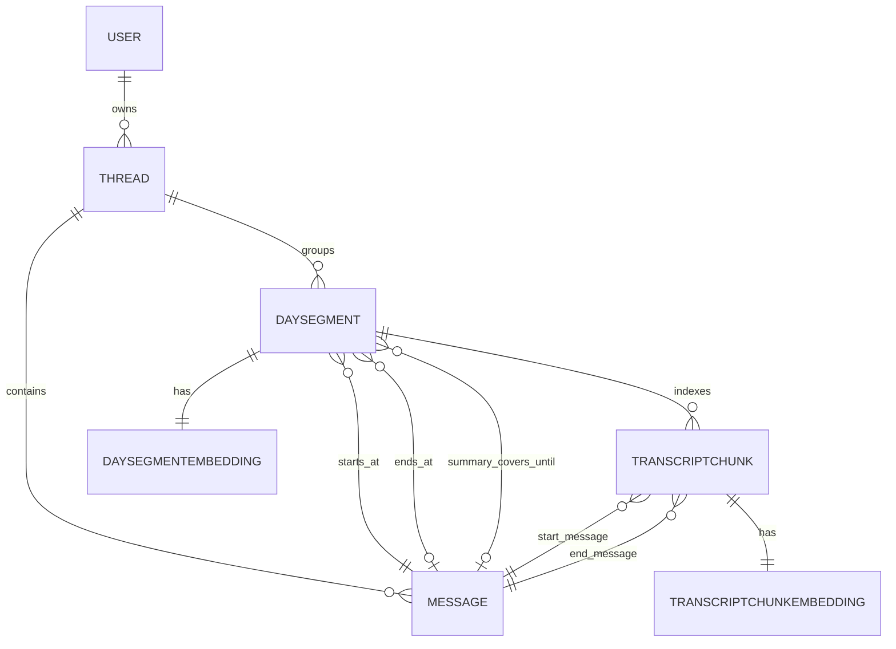

# Continuous Discussion Mode (Spec)

## 0. Goal

Add a **continuous discussion mode** to Nova that:

- lets a user continue the same discussion across days without creating new threads
- keeps context **bounded** (no runaway prompts)
- lives along the existing **thread-based** mode

This mode builds on the existing structured global memory (memory tool) and adds **conversation-level recall** for the ongoing continuous thread.

## 1. Key concepts

We separate 3 layers:

1) **Transcript**: raw [`Message`](nova/models/Message.py:1) rows in the continuous [`Thread`](nova/models/Thread.py:1)
2) **Day segments**: visible daily grouping + summaries (new `DaySegment`)
3) **Memory Tool**: durable user memory via `memory.search()`

Principle:

- **Messages remain source of truth** (not deleted). Summaries are derived artifacts.

## 2. Decisions

### 2.1 One continuous thread per user

- Exactly **one** continuous thread per user (default entry point)

### 2.2 Visible day segments with boundary = first message of the day

- Day segments are based on user timezone.
- A new day segment is opened on the **first message of that calendar day**.

Implication:

- a late-night session is not split exactly at midnight; it is grouped more naturally.

### 2.3 Default agent context in continuous mode

Default context payload (bounded):

- **Today raw window**: token budget 4k, with aggressive trimming of tool outputs
- **Today summary**: hybrid Markdown summary
- **Yesterday summary**: short Markdown summary
- Tool hints and policy (how to use memory and conversation tools)

Everything older is retrieved via `conversation.search` / `conversation.get`.

### 2.4 Conversation tools: search + get

We exposes two tools allowing the agent to read previous messages or summaries:

- `conversation.search` (global merge across summary + transcript candidates)
- `conversation.get` (fetch exact content by message id or by range)

### 2.5 conversation.search scope

Search scope:

- **summaries + transcript FTS + embeddings** (when embeddings enabled)
- single merged ranking; summaries and transcript are both searchable
- slight penalty for transcript hits that are already covered by a summary

### 2.6 Summary format and storage

- Summary format: **hybrid** (narrative + fixed sections)
- Storage: **Markdown block only**
- Generation: dedicated summarization prompt triggered by Nova (async job)

Suggested Markdown template:

```md
## Summary
<short narrative>

## Goals
- ...

## Decisions
- ...

## Open loops
- ...

## Next steps
- ...
```

### 2.7 Summary persistence and UI visibility

- The summary is stored only in `DaySegment.summary_markdown`.
- No `system` [`Message`](nova/models/Message.py:1) is persisted for summary updates.
- The web UI can display a lightweight “Day summary updated” UI event derived from `DaySegment.updated_at`.

### 2.8 Sub-agents are stateless and cannot call conversation tools

- Sub-agents do not keep persistent continuous context
- `conversation.search/get` are reserved to the main agent

## 3. UX text mockups (web)

This section is intentionally “ASCII UI” to validate the experience.

### 3.1 Main screen (continuous)

```
[Nova]

Top nav:  Continuous   Threads   Settings

Continuous
  Agent: Nova (default)

  Day selector: [Today ▼] [Yesterday] [Pick date]

  Search: [____________________] [Scope: Day ▼] [Go]

------------------------------------------------------------
Day Summary (Today)                      [Regenerate summary]

Summary
We continued designing the continuous discussion mode...

Goals
- Finalize tool surface and context policy

Decisions
- Day boundary is first message of the day

Open loops
- Define transcript chunking for embeddings

Next steps
- Spec conversation.search/get schemas
------------------------------------------------------------

Timeline (Today)

09:05  User:   On avance sur les segments journaliers.
09:06  Agent:  Ok, voici les options...

  10:12  UI: Day summary updated
        (summary panel refreshed)

10:13  User:   Et pour conversation.search ?
  10:14  Agent:  summaries + transcript FTS + embeddings...

[Type message…____________________________________] [Send]
```

### 3.2 Switching days

```
Day selector: [2026-01-29 ▼]

Timeline (2026-01-29)

  [Older messages folded ▸]

  18:10 UI: Day summary updated
        (summary panel refreshed)

  18:11 User/Agent messages...
```

### 3.3 Search in continuous mode

```
Search: [statut______________] [Scope: Day ▼] [Go]

Results

1) kind: summary   day: 2026-01-31   score: 0.78
   snippet: "Open loops: définir chunking embeddings..."
   action: [Open]

2) kind: message   day: 2026-01-31   score: 0.62   covered_by_summary: yes
   snippet: "...on mettra une pénalité légère..."
   action: [Open]
```

Where:

- “Open” calls `conversation.get` to fetch exact text for grounding.

### 3.4 Collapsing behavior after compaction (what the user sees)

Goal: when a compaction/summarization happens mid-day, the UI should make it obvious.

```
Timeline (Today)

  [Older messages folded ▸]    (these are now represented by the summary)

  14:32 UI: Day summary updated
        [expand summary panel]

  14:33 User:  Ok, continue.
  14:34 Agent: ...
```

In other words: we do not delete old messages, but we fold them in the UI once a summary has covered them.

## 4. Context and compaction behavior

### 4.1 Raw window budget (today)

- Budget: **4k tokens** for the “today raw” window.

Trimming priorities:

1) keep user+assistant natural language messages
2) trim tool outputs first (head/tail + placeholder)
3) drop oldest raw turns from today if still too large

### 4.2 Summary update triggers

Two mechanisms:

1) **Daily automatic summary**
   - when first message creates a new day segment, schedule a daily job to produce/update today summary
2) **Heuristic in-day summary**
  - async trigger when:
     - 10 new messages since last summary, OR
      - token pressure detected (near limit)

### 4.3 Transcript lifecycle vs summary

- Messages persist (source of truth).
- Summaries are derived artifacts.
- Transcript remains searchable even if content is covered by a summary.

## 5. Tool spec

### 5.1 `conversation.search`

Input:

- `query` string
- `day` optional `YYYY-MM-DD`
- `recency_days` optional (default: 14)
- `limit` int default 6 max 20
- `cursor` optional opaque string (cursor-based pagination)
- `min_score` optional float

Output:

- `results`: list of
  - `kind`: `summary|message`
  - `day_label`
  - `day_segment_id`
  - if `kind=message`:
    - `message_id` (representative id, typically the first message in the matched chunk window)
    - `snippet`
    - `covered_by_summary` bool
    - `score`
  - if `kind=summary`:
    - `summary_snippet`
    - `score`

API abstraction note:

- Transcript search may be implemented internally on `TranscriptChunk`, but the tool output intentionally exposes a stable `message_id` only.
- To inspect details and quote accurately, the agent should follow up with [`conversation.get`](plans/continuous_discussion.md:333) using that `message_id` (or a day/range).

Ranking:

- global merge (single sorted list)
- base score is hybrid:
  - normalize vector score to 0..1
  - normalize lexical (FTS) score to 0..1
  - `base_score = 0.7 * vector + 0.3 * fts`
  - if embeddings are disabled or missing for an item: treat `vector=0` and rely on FTS
- apply penalty when `covered_by_summary=true` (multiplier 0.85)
- tie-breakers: newer day, then newer message

Merge strategy:

- single global list
- combine `kind=summary` and `kind=message` candidates into one pool
- sort by `final_score` descending
- no fixed bonus for summaries (summaries tend to win naturally via higher-signal embeddings)

Default scope and pagination:

- Default scope is `recency_days=14`.
- If `day` is provided, it overrides recency scope (search only within that day segment).
- Pagination is **cursor-based**:
  - request passes `cursor`
  - response returns `next_cursor` when more results exist
  - cursor encodes the last `(score, kind, stable_id)` boundary (implementation detail)

Notes:

- This mirrors the “hybrid 70/30” idea used in Clawdbot, but should keep the exact coefficients configurable.
- If embeddings are disabled, transcript search falls back to FTS-only.

#### 5.1.1 `covered_by_summary`

Goal: mark transcript hits that are likely redundant because the **day summary already contains the same information**.

Approach (pragmatic + cheap): treat `covered_by_summary` as a **range-based coverage flag**.

Definition:

- A transcript item (message or chunk) is `covered_by_summary=true` when it is **older than the latest summary boundary for that day**.

Implementation details:

- We define a `DaySegment.summary_covers_until_message_id` (FK to [`Message`](nova/models/Message.py:1), nullable).
  - when a day summary job completes, it sets this field to the latest message id included in the summarization input
  - all messages/chunks with `message_id <= summary_covers_until_message_id` are considered covered

Why range-based vs semantic overlap:

- semantic coverage detection is expensive and error-prone
- range-based coverage is deterministic, fast, and aligns with the UI folding rule

Effect on ranking:

- still return covered transcript results (grounding + verifiability)
- apply a **light penalty** multiplier (default 0.85) so summaries win when both match
- if the user explicitly requests exact quotes or raw details, the agent should prefer `conversation.get` even if covered

### 5.2 `conversation.get`

Input (one-of):

- `message_id`
- `day_segment_id`
- `day_segment_id` + `from_message_id` + `to_message_id`

Pagination + limits:

- `limit` optional (default 30, max 30)
- `before_message_id` optional (for pagination)
- `after_message_id` optional (for pagination)

Rules:

- `message_id` returns a window around the message:
  - if `before_message_id/after_message_id` are not provided, return up to `limit` messages around `message_id` (implementation can choose exact split, ex: 15 before + 15 after)
  - if `before_message_id` is set, return up to `limit` messages strictly before it
  - if `after_message_id` is set, return up to `limit` messages strictly after it
- Hard output budget: best-effort cap at ~6k tokens; if exceeded, truncate and return a `truncated=true` marker

Output:

- if messages: ordered list of `{message_id, role, content, created_at}`
- if summary: `{day_segment_id, day_label, summary_markdown, updated_at}`

Output additions:

- `truncated` bool
- `next_before_message_id` / `next_after_message_id` optional, to support cursor-less paging on message ids

Multi-tenant and permissions:

- `conversation.get` only returns content belonging to the current authenticated user
- any `message_id` / `day_segment_id` outside the user scope must return a not-found style error

## 6. Prompt policy (avoid cannibalization)

Rule set:

- Durable fact / preference / long-term instruction → use [`memory.search()`](nova/tools/builtins/memory.py:207)
- Ongoing-thread detail across days → use `conversation.search/get`
- Never copy raw transcript into long-term memory automatically; use [`memory.add()`](nova/tools/builtins/memory.py:77) only when explicitly asked or clearly durable and non-sensitive

## 7. Data model

### 7.1 Thread mode

Decision: model continuous discussion as a **Thread mode**.

- Add `Thread.mode` with at least: `thread|continuous`.
- Continuous home resolves the user’s continuous thread via:
  - `Thread.objects.get(user=user, mode='continuous')`
  - if missing: create it.

Correctness note:

- The request path must be idempotent (handle concurrent create attempts safely).
- We can later add a PostgreSQL partial unique index to enforce **at most one** `mode='continuous'` thread per user, without changing API semantics.

### 7.2 `DaySegment`

New model (location suggestion: [`nova/models/DaySegment.py`](nova/models/DaySegment.py:1)):

- `user` FK
- `thread` FK (the continuous thread)
- `day_label` date
- `starts_at_message` FK → `Message`
- `ends_at_message` FK → `Message` nullable
- `summary_markdown` text
- `summary_covers_until_message` FK → `Message` nullable
- `updated_at`

Clarifications:

- `day_label` is computed using **user timezone**.
- `starts_at_message` is the **first message** that opened the day segment.
- `ends_at_message` is optional and can be used to mark the segment “closed” (nightly finalization), otherwise the segment is considered open.
- `summary_covers_until_message` defines the deterministic range boundary for [`covered_by_summary`](plans/continuous_discussion.md:290).

Indexes:

- unique `(user_id, thread_id, day_label)`

Recommended additional indexes:

- `(user_id, thread_id, starts_at_message_id)`
- `(user_id, thread_id, day_label DESC)` for “latest day” lookups

Invariants:

- `starts_at_message.thread_id == DaySegment.thread_id`
- if set, `ends_at_message.thread_id == DaySegment.thread_id`
- if set, `summary_covers_until_message.thread_id == DaySegment.thread_id`

Additional invariants:

- if set, `ends_at_message_id >= starts_at_message_id`
- if set, `summary_covers_until_message_id >= starts_at_message_id`
- if both set, `summary_covers_until_message_id <= ends_at_message_id`

Update rules:

- On day creation, set `starts_at_message` to the triggering message; leave `ends_at_message` null.
- On nightly finalization:
  - set `ends_at_message` to the latest message of the day
  - generate final summary and set `summary_covers_until_message` to the latest summarized message
- On heuristic in-day summary update:
  - keep `ends_at_message` null
  - update `summary_markdown`
  - advance `summary_covers_until_message` forward (monotonic) to the latest summarized message

Important: `summary_covers_until_message` must be monotonic within a day segment (never move backwards).

### 7.3 Derived indexes for transcript search

We will need derived structures for:

- FTS over transcript
- embeddings over transcript chunks

This will likely mirror Memory v2 patterns but scoped to the continuous thread/day segments.

#### 7.3.1 `TranscriptChunk` (+ optional embeddings)

Plain-language definition:

- A `TranscriptChunk` is a **small slice of the continuous conversation transcript**, built by concatenating several consecutive messages into one searchable document.
- It exists because searching the raw [`Message`](nova/models/Message.py:1) table directly is often too granular (too many rows) and not ideal for embeddings.
- It is the **unit of retrieval** for `conversation.search` on the transcript side.

Key properties:

- Bounded size: targets ~600 tokens per chunk (with small overlap) so embeddings are meaningful and comparable.
- Provenance: stores `start_message_id` and `end_message_id`, so once we find a relevant chunk we can fetch the exact raw turns with [`conversation.get`](plans/continuous_discussion.md:290).
- Normalization: tool outputs and noisy payloads are trimmed so the chunk represents the “human conversation” more than logs.

We index the transcript via **chunk windows** (not per message) to control volume.

New model suggestion: [`nova/models/TranscriptChunk.py`](nova/models/TranscriptChunk.py:1)

- `user` FK
- `thread` FK (the continuous thread)
- `day_segment` FK (optional but recommended for fast day-scoped search)
- `start_message` FK → [`Message`](nova/models/Message.py:1)
- `end_message` FK → [`Message`](nova/models/Message.py:1)
- `content_text` (normalized concatenation of included message contents; tool outputs trimmed)
- `content_hash` (dedupe + idempotence)
- `token_estimate` (for budgeting and diagnostics)
- `created_at`
- `updated_at`

Clarifications:

- A chunk represents an **ordered contiguous window** of messages within a single day segment.
- A chunk is the unit for transcript search (FTS + embeddings) and returns provenance via `start_message_id/end_message_id`.

Chunk construction inputs:

- include `user` + `assistant` messages by default
- Decision: exclude `system` messages from transcript chunks (including day summary system messages).
- exclude or heavily trim tool call payloads/results

Indexes/constraints:

- unique `(user_id, thread_id, start_message_id, end_message_id)`
- index `(user_id, thread_id, day_segment_id, start_message_id)`

Recommended additional indexes:

- `(user_id, thread_id, end_message_id)` to map a message id to candidate chunks
- if day-scoped searches are common: `(user_id, day_segment_id)`

Invariants:

- `start_message.thread_id == TranscriptChunk.thread_id`
- `end_message.thread_id == TranscriptChunk.thread_id`
- `start_message_id <= end_message_id`

Additional invariants:

- `day_segment.thread_id == TranscriptChunk.thread_id`
- `start_message.created_at` and `end_message.created_at` fall within the day segment’s effective window

`content_hash`:

- deterministic hash of the normalized `content_text` + boundary ids
- used to make chunk recomputation idempotent (nightly job can upsert)

Update model:

- append-only during the day: new chunks cover new messages after the last indexed `end_message_id`
- nightly recompute: can rewrite chunk boundaries for a day; use `content_hash` + upsert to keep idempotence

##### Strategy: append-only (daytime) vs nightly recompute

We combine two behaviors:

1) **Append-only in-day**
   - When new messages arrive, we index them by creating new chunks that start after the last `end_message_id`.
   - This avoids rewriting many rows during interactive usage.

2) **Nightly recompute (per day segment)**
   - At day finalization, rebuild chunks for the whole day using the target window size (~600 tokens + overlap).
   - Upsert chunks by `(user_id, thread_id, start_message_id, end_message_id)` and `content_hash`.
   - Delete obsolete chunks for that day segment (those not present in the recompute result).

Why we need recompute:

- append-only chunking can drift (suboptimal boundaries) when message sizes vary
- nightly recompute yields stable, evenly-sized windows that improve recall and ranking

Concurrency notes:

- nightly recompute should lock per `(user_id, day_segment_id)` to avoid racing with in-day append indexing
- in-day chunk append should be resilient to duplicate creation by using unique constraints + retry

FTS:

- store a materialized `tsvector` column (or compute via functional index)
- language config should follow current project defaults (to confirm)

Embeddings (optional, when enabled):

- store in a separate table mirroring Memory v2 embedding patterns
- dimensions and padding rules should reuse Memory v2 rules

New model suggestion: [`nova/models/TranscriptChunkEmbedding.py`](nova/models/TranscriptChunkEmbedding.py:1)

- `chunk` OneToOne → `TranscriptChunk`
- `embedding` pgvector(1024)
- `provider_label` / `model_label` (for rebuilds and debugging)
- `created_at`

Indexes:

- OneToOne enforces unique on `chunk_id`
- vector index (pgvector) aligned with Memory v2 approach (to confirm chosen index type)

Notes:

- We keep transcript search artifacts **scoped to the continuous thread** (not global).
- Retention: V1 keeps all chunks (messages are source-of-truth anyway); later we can add pruning if needed.

#### 7.3.2 Summary indexing

To make `conversation.search` summaries-first fast, we can add:

- FTS index on `DaySegment.summary_markdown`
- embeddings for `DaySegment.summary_markdown` (lowest volume, highest value)

If we do summary embeddings, we can reuse the Memory v2 embedding pipeline pattern.

##### `DaySegmentEmbedding`

New model suggestion: [`nova/models/DaySegmentEmbedding.py`](nova/models/DaySegmentEmbedding.py:1)

- `day_segment` OneToOne → [`DaySegment`](nova/models/DaySegment.py:1)
- `embedding` pgvector(1024)
- `provider_label` / `model_label`
- `created_at`

Indexes:

- OneToOne enforces unique on `day_segment_id`
- vector index (pgvector) aligned with the project’s chosen index type

### 7.4 Embeddings strategy for continuous mode

Decision:

- Embeddings are computed for:
  - `DaySegment.summary_markdown` (high signal, low volume)
  - `TranscriptChunk.content_text` (better recall on raw details)

Provider selection and vector rules:

- reuse the existing Memory v2 embedding provider selection precedence and vector padding rules (1024 dims, zero-pad, reject larger)
- embeddings are computed asynchronously via Celery

Throttling:

- no numeric quota in V1
- use a **dedicated Celery queue** for conversation embeddings, ex: `conversation_embeddings`
  - allows separate worker sizing and prevents starving agent execution

Rebuild policy:

- if the user changes embedding provider/model, mark conversation embeddings stale and enqueue rebuild gradually
- rebuild can be prioritized: summaries first, then chunks

### 7.5 Lexical search (FTS) strategy

We use PostgreSQL full-text search (FTS) as the lexical signal for [`conversation.search`](plans/continuous_discussion.md:253).

#### 7.5.1 What is indexed

1) **Summaries**

- `DaySegment.summary_markdown`
- recommended: add a `tsvector` column (materialized) or a functional index over `to_tsvector(...)`

2) **Transcript**

- `TranscriptChunk.content_text`
- recommended: add a `tsvector` column (materialized) or a functional index

Rationale:

- `DaySegment` gives low-volume, high-signal summary search
- `TranscriptChunk` enables exact-detail lexical retrieval without scanning raw [`Message`](nova/models/Message.py:1)

#### 7.5.2 Language configuration

Decision:

- use the same `to_tsvector` config as Memory v2 / current implementation: `english`.

#### 7.5.3 Ranking signal and normalization

We need the lexical score normalized to 0..1 to combine with vector score in [`conversation.search`](plans/continuous_discussion.md:253).

V1 approach (simple + stable):

- compute `fts_raw` using `ts_rank_cd(tsvector, plainto_tsquery(...))` (or `websearch_to_tsquery` if you want richer parsing)
- normalize by a saturating transform:
  - `fts = fts_raw / (fts_raw + 1)`

Notes:

- this avoids needing corpus-wide min/max per query
- keeps the combined score stable across different days/users

#### 7.5.4 Query parsing

Decision:

- `plainto_tsquery` for safety and predictable behavior.

#### 7.5.5 Indexing and updates

- On `DaySegment.summary_markdown` update:
  - update the `summary_tsv` field (if materialized)
  - optionally enqueue embeddings job for `DaySegmentEmbedding`
- On `TranscriptChunk` creation/update:
  - update the `content_tsv` field (if materialized)
  - optionally enqueue embeddings job for `TranscriptChunkEmbedding`

## 8. Celery workflows

This section specifies the async jobs required for continuous discussion mode.

### 8.1 Goals

- produce and refresh day summaries (nightly + in-day)
- keep transcript indexing up-to-date (chunks + FTS + embeddings when enabled)
- ensure idempotence and safe concurrency
 - provide observability: user-visible UI events + task logs

### 8.2 Task inventory (proposed)

Suggested task module: [`nova/tasks/conversation_tasks.py`](nova/tasks/conversation_tasks.py:1)

1) `ensure_continuous_thread(user_id)`
   - resolves/creates the user’s continuous [`Thread`](nova/models/Thread.py:1) (`Thread.mode='continuous'`)
   - should be callable from request path but implemented as an idempotent helper

2) `ensure_day_segment(user_id, thread_id, day_label)`
   - idempotently creates the [`DaySegment`](nova/models/DaySegment.py:1) if missing
   - sets `starts_at_message` on creation

3) `summarize_day_segment(day_segment_id, mode)`
   - `mode`: `heuristic|nightly|manual`
   - builds summarization input:
     - messages from `starts_at_message` to current end (or latest message if open)
     - trims tool outputs aggressively
     - may include previous summary as context to make summarization incremental
    - writes:
      - `DaySegment.summary_markdown`
      - advances `DaySegment.summary_covers_until_message`
    - no transcript message is created; the UI shows the updated summary panel

4) `index_transcript_append(day_segment_id, from_message_id)`
   - creates new [`TranscriptChunk`](nova/models/TranscriptChunk.py:1) rows for messages after `from_message_id`
   - should be lightweight and safe to run frequently

5) `recompute_day_transcript_index(day_segment_id)`
   - rebuilds chunks for a day segment (nightly)
   - deletes obsolete chunks and upserts new ones deterministically
   - optionally triggers embeddings rebuild for affected chunks

6) `compute_transcript_chunk_embedding(chunk_id)`
   - mirrors Memory v2 embedding pipeline (provider selection, padding)
   - stores into [`TranscriptChunkEmbedding`](nova/models/TranscriptChunkEmbedding.py:1)

7) `compute_day_segment_embedding(day_segment_id)`
   - computes embedding for `DaySegment.summary_markdown`
   - stores into [`DaySegmentEmbedding`](nova/models/DaySegmentEmbedding.py:1)

8) `finalize_previous_day_segments(user_id, day_label_cutoff)`
   - Celery Beat scheduler entry point
   - closes any open day segments older than “today” in user timezone
   - runs: `summarize_day_segment(mode=nightly)` + `recompute_day_transcript_index`

### 8.3 Trigger points

#### 8.3.1 On each new user message (continuous mode)

- resolve continuous thread and today day segment
- enqueue lightweight tasks:
  - `index_transcript_append(day_segment_id, last_indexed_message_id)`
- decide if heuristic summary triggers and enqueue:
  - `summarize_day_segment(day_segment_id, mode=heuristic)`

Heuristic triggers (V1):

- >= 10 new messages since `summary_covers_until_message`
- OR token pressure detected during context build

#### 8.3.2 Nightly scheduler (Celery Beat)

- for each user:
  - compute “today” in user timezone
  - finalize all open segments with `day_label < today`
  - run nightly summarize + recompute index

### 8.4 Idempotence + concurrency control

Principles:

- tasks are safe to retry
- only one summarization or recompute runs at a time per `(user_id, day_segment_id)`

Locking strategy (decision):

- **DB lock only**
  - use DB row-level lock on [`DaySegment`](nova/models/DaySegment.py:1) (`SELECT ... FOR UPDATE`) inside the task
  - keep transactions short and avoid holding locks during LLM calls when possible (see note below)
  - Redis locks are a V2 option if we observe contention

Note on long LLM calls:

- Holding a DB lock while waiting on an LLM is undesirable.
- Recommended pattern:
  1) lock `DaySegment` and compute the exact summarization boundaries (`from_message_id` → `to_message_id`)
  2) persist a lightweight “job intent” marker (ex: `summarization_in_progress_until_message_id` or a Task row)
  3) release lock
  4) run LLM summarization
  5) re-lock and apply updates if boundaries still match expectations

Idempotence rules:

- `summary_covers_until_message` is monotonic; if task runs twice it should not regress
- `TranscriptChunk` creation uses a unique constraint to avoid duplicates
- nightly recompute deletes chunks not in the recompute set (safe if lock is held)

### 8.5 Failure handling + retries

- summarization failures:
  - retry with exponential backoff (limited)
  - if still failing, keep last known summary and append an internal error log (not a user-visible message)
- indexing failures:
  - safe to retry; worst case search coverage is delayed

### 8.6 Observability

User-visible:

- UI event “Day summary updated” rendered using `DaySegment.updated_at` (no persisted transcript message)

Internal:

- Celery task status stored in existing task tracking (if present) and logged
- include `day_segment_id`, `thread_id`, `start/end message ids`, and token estimates in logs

## 9. Transcript chunking for embeddings

We must avoid indexing per-token/per-message with excessive volume.

Candidates:

- Chunk per message (simplest, can be noisy/short)
- Chunk by window of messages (e.g. group contiguous messages into ~400–800 token blocks with overlap)
- Chunk by turn-pairs (user+assistant)

Recommendation: group by contiguous windows to reduce index cardinality, with provenance back to message ids.

### 9.1 Chunking strategy (decision)

Decision: **chunks by windows of messages** with:

- target size: ~600 tokens per chunk
- overlap: small overlap (ex: ~100 tokens or N last messages) to reduce boundary misses
- provenance: chunk stores `start_message_id` + `end_message_id`
- updates:
  - **append-only during the day** (create new chunks only for new messages)
  - **recompute at end of day** (nightly) to consolidate and improve chunk boundaries

Chunk composition rules:

- include only user/assistant natural language by default
- exclude system messages (summaries are indexed separately; keep transcript chunks focused on raw dialogue)
- aggressively trim tool outputs (head/tail + placeholders), consistent with [`4.1 Raw window budget (today)`](plans/continuous_discussion.md:213)

Rationale:

- avoids per-message index explosion
- keeps enough granularity for retrieval grounding via [`conversation.get`](plans/continuous_discussion.md:290)

## 10. Mermaid diagrams

### 10.1 Agent run context build


### 10.2 conversation.search flow


### 10.3 Day segment creation flow


### 10.4 Summary update flow (daily + heuristic)


### 10.5 Data model ERD



Notes:

- Cardinalities are conceptual; actual DB constraints are via FK/OneToOne + unique indexes.
- All entities are user-scoped (multi-tenant). The `user` FK is included even when `thread` exists to make filtering and indexes explicit.

## 11. UI + endpoints mapping

Decision: add a dedicated continuous page at route `continuous/`, and keep the existing thread-based home page unchanged.

### 11.1 Routes

Add new server-rendered views:

- `GET continuous/` → render continuous home (day selector + day summary + timeline)
- `GET continuous/day/<YYYY-MM-DD>/` (optional) → open a specific day
- `POST continuous/search/` (HTMX) → run [`conversation.search`](plans/continuous_discussion.md:243) and render results fragment
- `GET continuous/messages/` (HTMX) → fetch message window around `message_id` (wraps [`conversation.get`](plans/continuous_discussion.md:333))
- `POST continuous/add-message/` (HTMX) → append a user message into the continuous thread and start agent execution (Celery task), returning the appended message fragment
- `POST continuous/regenerate-summary/` (HTMX) → manual trigger: enqueue `summarize_day_segment(mode=manual)`

### 11.7 Real-time streaming

Decision:

- Reuse the existing WebSocket + Celery task progress pipeline (same consumer pattern as thread mode).

Expected flow (continuous):

1) User submits `POST continuous/add-message/`
2) View appends the user message in the backing continuous `Thread` (`Thread.mode='continuous'`).
3) View enqueues the existing agent execution task (same as thread mode), passing:
   - `thread_id` = continuous thread id
   - `agent_config` = default agent
4) Frontend connects to the same WebSocket channel used for task progress (see [`nova/routing.py`](nova/routing.py:1))
5) UI updates as events arrive (tool calls, streaming tokens, final assistant message)

Notes:

- Continuous mode should not introduce a new streaming mechanism (no SSE).
- Only routing and thread resolution differ; task tracking and WebSocket infra stay the same.

### 11.8 Day selector

Goal:

- allow the user to navigate day segments in the continuous thread quickly
- default to Today

UI controls:

- Quick picks:
  - `Today`
  - `Yesterday`
- Date picker:
  - calendar date input (opens a specific `day_label`)
- Optional dropdown:
  - shows the most recent N day segments (N=30) with a “Load more” action

Data source:

- list is derived from [`DaySegment`](nova/models/DaySegment.py:1) rows for the continuous thread.

Recommended endpoint:

- `GET continuous/days/` (HTMX fragment)
  - returns a list of available day segments, ordered by `day_label DESC`
  - supports cursor pagination by `day_label` or by `(day_label, id)`

How to compute Today/Yesterday:

- use **user timezone** (same rule as day segments)
- Today = current local date
- Yesterday = Today - 1 day

Open-day behavior:

- If Today has no DaySegment yet, it is created on first message; until then the UI can show an empty timeline with “No messages yet today”.

Loading a selected day:

- changing day triggers a refresh of:
  - day summary block
  - timeline block
  - search scope default (Day)

## 12. Implementation checklist

This is an execution-oriented checklist to implement the spec.

### 12.1 Data model + migrations

- Add/extend [`Thread`](nova/models/Thread.py:1) with `mode` field.
- Add model [`DaySegment`](nova/models/DaySegment.py:1)
   - include `summary_covers_until_message` (FK to [`Message`](nova/models/Message.py:1))
- Add model [`TranscriptChunk`](nova/models/TranscriptChunk.py:1)
   - include `content_text`, `content_hash`, `token_estimate`
   - exclude `system` messages from chunk content
- Add model [`TranscriptChunkEmbedding`](nova/models/TranscriptChunkEmbedding.py:1) (pgvector(1024))
- Add model [`DaySegmentEmbedding`](nova/models/DaySegmentEmbedding.py:1) (pgvector(1024))
- Add indexes:
  - unique `(user_id, thread_id, day_label)` on DaySegment
  - unique `(user_id, thread_id, start_message_id, end_message_id)` on TranscriptChunk
  - vector indexes for embedding tables (pgvector)
  - FTS indexes/columns for `DaySegment.summary_markdown` and `TranscriptChunk.content_text`

Notes:

- `Thread.mode` must be added and migration must ensure default mode for existing rows.

### 12.2 Tools: `conversation.search` + `conversation.get`

- Implement tool handler(s) following the schemas in:
  - [`conversation.search`](plans/continuous_discussion.md:376)
  - [`conversation.get`](plans/continuous_discussion.md:466)
- Enforce user-scoping (multi-tenant) and not-found semantics
- Implement scoring:
  - `base_score = 0.7*vector + 0.3*fts` with normalization
  - apply `covered_by_summary` penalty multiplier 0.85
  - merge: single global sorted list
- Implement cursor pagination for `conversation.search` (`cursor` + `next_cursor`)

### 12.3 Indexing pipelines

- Implement chunking:
  - append-only in-day chunk creation
  - nightly recompute per day segment (delete obsolete, upsert deterministic)
- Implement FTS updates for summary + chunks (config `english` to match current Memory v2)
- Implement embeddings jobs:
  - compute embeddings for DaySegment summaries and TranscriptChunks
  - use queue `conversation_embeddings`
  - reuse Memory v2 embedding provider selection + padding rules

### 12.4 Celery workflows

- Create task module [`nova/tasks/conversation_tasks.py`](nova/tasks/conversation_tasks.py:1)
- Implement tasks listed in [`Celery workflows`](plans/continuous_discussion.md:234)
- Add Celery Beat schedule:
  - nightly `finalize_previous_day_segments` per user
- Concurrency:
  - DB row lock on DaySegment (`SELECT ... FOR UPDATE`)
  - avoid holding locks during LLM calls (two-phase pattern)

### 12.5 Views + templates (web UI)

- Add routes described in [`UI + endpoints mapping`](plans/continuous_discussion.md:1063)
  - `GET continuous/`
  - `POST continuous/add-message/` (HTMX)
  - `POST continuous/search/` (HTMX)
  - `GET continuous/messages/` (HTMX)
  - `POST continuous/regenerate-summary/` (HTMX)
  - `GET continuous/days/` (HTMX)
- Templates:
  - `nova/templates/nova/continuous/index.html`
  - partials for day selector, day summary, timeline, search results, message window
- Folding:
  - fold messages older than `summary_covers_until_message_id`
- Agent selection:
  - no selection in V1; always resolve user default agent
- Streaming:
  - reuse existing WebSocket task progress pipeline (see [`nova/routing.py`](nova/routing.py:1))

### 12.6 Tests

- Model tests:
   - Thread.mode continuous get-or-create logic
   - DaySegment invariants and monotonic `summary_covers_until_message`
   - TranscriptChunk chunk boundary and idempotence (`content_hash`)
- Tool tests:
  - `conversation.search` scoring + pagination + user scoping
  - `conversation.get` windowing (`limit`, `before_message_id`, `after_message_id`, truncation)
- Task tests:
  - nightly finalize closes segments and triggers summary + reindex
  - heuristic triggers do not regress summary boundary

### 12.7 Rollout notes

- Initial backfill:
  - on first visit to `continuous/`, lazily create the continuous Thread and DaySegment on first message
- Observability:
  - ensure the summary panel and the “Day summary updated” UI event are visible

Notes:

- We should keep existing endpoints like [`add_message`](nova/views/thread_views.py:221) for thread mode, but introduce a continuous-specific message posting endpoint to avoid mixing semantics.

### 11.2 Templates

Suggested new templates (names indicative):

- `nova/templates/nova/continuous/index.html`
- `nova/templates/nova/continuous/partials/day_selector.html`
- `nova/templates/nova/continuous/partials/day_summary.html`
- `nova/templates/nova/continuous/partials/timeline.html`
- `nova/templates/nova/continuous/partials/search_results.html`
- `nova/templates/nova/continuous/partials/message_window.html`

### 11.3 Navigation

- Top nav adds: `Continuous` linking to `continuous/`.
- Threads mode remains accessible via existing navigation.

### 11.3.1 Agent selection

Decision:

- No agent selection UI in continuous mode.
- Continuous mode always uses the user’s **default agent**.

Implications:

- the `continuous/` page should not expose an agent dropdown
- the backend must resolve “default agent” deterministically (existing user settings / default AgentConfig)
- multi-agent continuous discussions are intentionally out of scope for now

### 11.4 Folding behavior (UI)

Rule:

- In the timeline for a day, messages with `message_id <= DaySegment.summary_covers_until_message_id` are folded under an “Older messages” expander.

### 11.5 Search UX

- Search form submits to `continuous/search/`.
- Scope selector:
  - `Day` → passes `day=<selected day>` to [`conversation.search`](plans/continuous_discussion.md:376)
  - `Recent` → uses default `recency_days=14`

### 11.6 Permissions and multi-tenancy

- All continuous endpoints are `login_required`.
- All queries must be filtered by `request.user`.

## 13. Open questions (intentionally unresolved)

- Do we want a dedicated UI affordance to “promote” a conversation excerpt into Memory v2 (user-confirmed), or keep it manual via chat instruction only?

## 14. Risks and clarifications

This section captures non-obvious implementation risks and places where extra care is needed.

### 14.1 Continuous thread uniqueness

- Without a DB constraint, concurrent requests can attempt to create multiple continuous threads.
- Recommended: implement idempotent creation (transaction + retry on integrity error).
- Optional hardening: add a PostgreSQL partial unique index later (at most one `Thread` with `mode='continuous'` per user).

### 14.2 Transcript indexing complexity

- Maintaining two indexing behaviors (append-only during the day + nightly recompute) adds operational complexity.
- If you want a simpler first implementation, pick one strategy (append-only only, or recompute-only).

### 14.3 `conversation.search` complexity

- Hybrid scoring (FTS + embeddings) + cursor pagination is substantial.
- A simplification path is to start with lexical-only (FTS) and add embeddings later.
