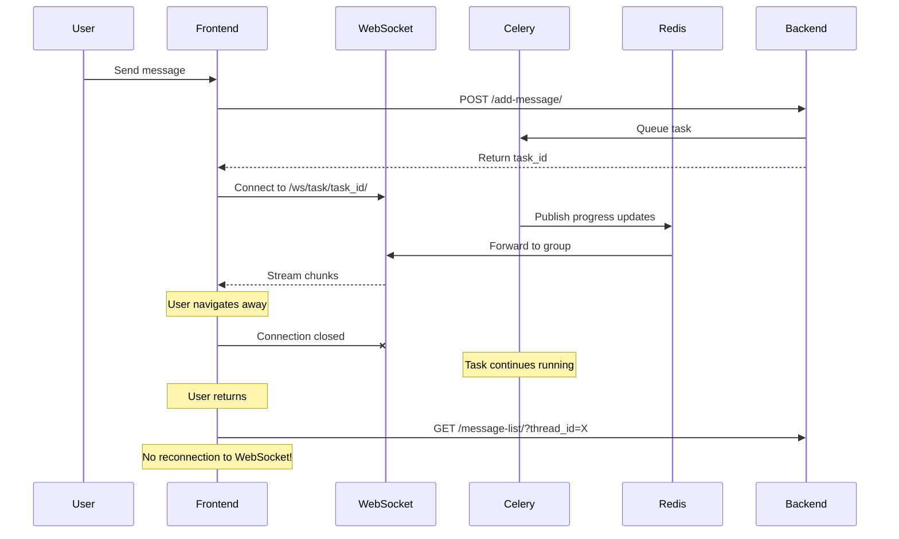
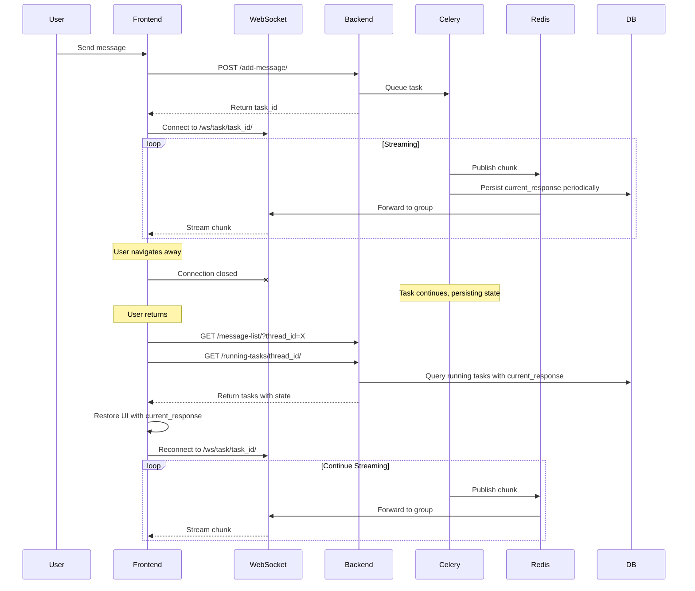

# Plan: Reconnect Streaming When User Returns to Conversation

## Problem Summary

When a user navigates away from a conversation page while an agent task is running and then returns, they don't see the progress updates or streaming response. The WebSocket connection is lost on navigation and never re-established.

## Root Cause Analysis

### Current Architecture



### Key Issues Identified

1. **No reconnection logic in [`loadMessages()`](nova/static/js/message-manager.js:132)**: When messages are loaded, there's no check for running tasks.

2. **Backend endpoint exists but unused**: [`running_tasks()`](nova/views/task_views.py:10) at `/running-tasks/{thread_id}/` returns running task IDs but is never called.

3. **No streaming state persistence**: The [`TaskProgressHandler.final_chunks`](nova/tasks/TaskProgressHandler.py:18) stores the current response in memory only - it's not persisted to the database.

4. **Task model has partial support**: [`Task.progress_logs`](nova/models/Task.py:39) stores progress but not the streaming content.

## Proposed Solution

### Approach: Reconnect + State Recovery

The solution has two parts:
1. **Reconnect to WebSocket** when returning to a page with running tasks
2. **Recover partial state** so the user sees what has been generated so far

### Implementation Plan

#### Phase 1: Frontend Reconnection Logic

**File: [`nova/static/js/message-manager.js`](nova/static/js/message-manager.js)**

Add a method to check for running tasks and reconnect:

```javascript
async checkAndReconnectRunningTasks() {
    if (!this.currentThreadId) return;
    
    try {
        const response = await fetch(
            `${window.NovaApp.urls.runningTasksBase}${this.currentThreadId}/`
        );
        const data = await response.json();
        
        if (data.running_task_ids && data.running_task_ids.length > 0) {
            // Reconnect to each running task
            for (const taskId of data.running_task_ids) {
                this.streamingManager.reconnectToTask(taskId);
            }
        }
    } catch (error) {
        console.error('Error checking running tasks:', error);
    }
}
```

Call this method at the end of [`loadMessages()`](nova/static/js/message-manager.js:132):

```javascript
// After loading messages, check for running tasks
this.checkAndReconnectRunningTasks();
```

#### Phase 2: StreamingManager Reconnection Support

**File: [`nova/static/js/streaming-manager.js`](nova/static/js/streaming-manager.js)**

Add a method to reconnect to an existing task:

```javascript
reconnectToTask(taskId) {
    // Check if already connected
    if (this.activeStreams.has(taskId)) {
        return;
    }
    
    // Register the stream with reconnect flag
    this.activeStreams.set(taskId, {
        messageId: taskId,
        element: null,
        status: 'reconnecting',
        isReconnect: true
    });
    
    // Show progress area
    const progressDiv = document.getElementById('task-progress');
    if (progressDiv) {
        progressDiv.classList.remove('d-none');
        const spinner = progressDiv.querySelector('.spinner-border');
        if (spinner) spinner.classList.remove('d-none');
    }
    
    // Start WebSocket connection
    this.startWebSocket(taskId);
}
```

Modify [`onStreamChunk()`](nova/static/js/streaming-manager.js:55) to handle reconnection:

```javascript
onStreamChunk(taskId, chunk) {
    const stream = this.activeStreams.get(taskId);
    if (!stream) return;
    
    // Skip empty or duplicate chunks
    if (!chunk || chunk.trim() === '' || chunk === stream.lastChunk) {
        return;
    }
    
    // Create message element if needed (including on reconnect)
    if (!stream.element) {
        stream.element = this.createMessageElement(taskId);
        stream.status = 'streaming';
    }
    
    const contentEl = stream.element.querySelector('.streaming-content');
    contentEl.innerHTML = chunk;
    stream.lastChunk = chunk;
}
```

#### Phase 3: Backend State Persistence

**File: [`nova/models/Task.py`](nova/models/Task.py)**

Add a field to store the current streaming content:

```python
class Task(models.Model):
    # ... existing fields ...
    
    # Current streaming content (HTML) - updated during streaming
    current_response = models.TextField(blank=True, null=True)
```

**File: [`nova/tasks/TaskProgressHandler.py`](nova/tasks/TaskProgressHandler.py)**

Update the handler to persist streaming content periodically:

```python
class TaskProgressHandler(AsyncCallbackHandler):
    def __init__(self, task_id, channel_layer):
        self.task_id = task_id
        self.channel_layer = channel_layer
        self.final_chunks = []
        self.current_tool = None
        self.tool_depth = 0
        self.token_count = 0
        self._last_persist_count = 0
        self._persist_interval = 50  # Persist every 50 tokens
    
    async def on_llm_new_token(self, token: str, *, run_id: UUID, 
                               parent_run_id: Optional[UUID] = None,
                               **kwargs: Any) -> Any:
        try:
            if self.tool_depth == 0:
                self.final_chunks.append(token)
                full_response = ''.join(self.final_chunks)
                clean_html = markdown_to_html(full_response)
                await self.on_chunk(clean_html)
                
                # Persist periodically for recovery
                self.token_count += 1
                if self.token_count - self._last_persist_count >= self._persist_interval:
                    await self._persist_current_response(clean_html)
                    self._last_persist_count = self.token_count
            else:
                self.token_count += 1
                if self.token_count % 100 == 0:
                    await self.on_progress("Sub-agent still working...")
        except Exception as e:
            logger.error(f"Error in on_llm_new_token: {e}")
    
    async def _persist_current_response(self, html_content):
        """Persist current response to database for recovery."""
        from nova.models.Task import Task
        try:
            await sync_to_async(
                Task.objects.filter(id=self.task_id).update,
                thread_sensitive=False
            )(current_response=html_content)
        except Exception as e:
            logger.error(f"Error persisting current response: {e}")
```

#### Phase 4: API Endpoint Enhancement

**File: [`nova/views/task_views.py`](nova/views/task_views.py)**

Enhance the endpoint to return current state:

```python
@login_required
def running_tasks(request, thread_id):
    thread = get_object_or_404(Thread, id=thread_id, user=request.user)
    if thread.user != request.user:
        return JsonResponse({'error': 'Unauthorized'}, status=403)
    
    running_tasks = Task.objects.filter(
        thread=thread, 
        user=request.user,
        status__in=[TaskStatus.RUNNING, TaskStatus.AWAITING_INPUT]
    ).values('id', 'status', 'current_response', 'progress_logs')
    
    tasks_data = []
    for task in running_tasks:
        tasks_data.append({
            'id': task['id'],
            'status': task['status'],
            'current_response': task['current_response'],
            'last_progress': task['progress_logs'][-1] if task['progress_logs'] else None
        })
    
    return JsonResponse({'running_tasks': tasks_data})
```

#### Phase 5: Frontend State Recovery

**File: [`nova/static/js/message-manager.js`](nova/static/js/message-manager.js)**

Update the reconnection method to use the enhanced API:

```javascript
async checkAndReconnectRunningTasks() {
    if (!this.currentThreadId) return;
    
    try {
        const response = await fetch(
            `${window.NovaApp.urls.runningTasksBase}${this.currentThreadId}/`
        );
        const data = await response.json();
        
        if (data.running_tasks && data.running_tasks.length > 0) {
            for (const task of data.running_tasks) {
                // Reconnect with initial state
                this.streamingManager.reconnectToTask(
                    task.id, 
                    task.current_response,
                    task.last_progress
                );
            }
        }
    } catch (error) {
        console.error('Error checking running tasks:', error);
    }
}
```

**File: [`nova/static/js/streaming-manager.js`](nova/static/js/streaming-manager.js)**

Update reconnect method to restore state:

```javascript
reconnectToTask(taskId, currentResponse, lastProgress) {
    if (this.activeStreams.has(taskId)) return;
    
    // Register stream
    this.activeStreams.set(taskId, {
        messageId: taskId,
        element: null,
        status: 'reconnecting',
        isReconnect: true,
        lastChunk: currentResponse || ''
    });
    
    // Show progress area with last known progress
    const progressDiv = document.getElementById('task-progress');
    if (progressDiv) {
        progressDiv.classList.remove('d-none');
        const spinner = progressDiv.querySelector('.spinner-border');
        if (spinner) spinner.classList.remove('d-none');
        
        const progressLogs = document.getElementById('progress-logs');
        if (progressLogs && lastProgress) {
            progressLogs.textContent = lastProgress.step || 'Reconnecting...';
        }
    }
    
    // If we have current response, show it immediately
    if (currentResponse) {
        const stream = this.activeStreams.get(taskId);
        stream.element = this.createMessageElement(taskId);
        const contentEl = stream.element.querySelector('.streaming-content');
        contentEl.innerHTML = currentResponse;
    }
    
    // Connect to WebSocket for live updates
    this.startWebSocket(taskId);
}
```

## Implementation Checklist

- [ ] Add `current_response` field to Task model
- [ ] Create database migration
- [ ] Update TaskProgressHandler to persist streaming content
- [ ] Enhance running_tasks API endpoint
- [ ] Add `checkAndReconnectRunningTasks()` to MessageManager
- [ ] Add `reconnectToTask()` to StreamingManager
- [ ] Update `onStreamChunk()` to handle reconnection
- [ ] Call reconnection check in `loadMessages()`
- [ ] Test with various scenarios:
  - [ ] User returns during streaming
  - [ ] User returns during tool execution
  - [ ] User returns when task is awaiting input
  - [ ] Multiple running tasks
  - [ ] Task completes while user is away

## Architecture After Fix



## Risks and Mitigations

| Risk | Mitigation |
|------|------------|
| Database write overhead from persisting every chunk | Persist every N tokens (e.g., 50) instead of every token |
| Race condition between DB read and WebSocket reconnect | Frontend handles duplicate chunks gracefully (already implemented) |
| Large current_response field | Clear field when task completes; consider max length |
| Multiple browser tabs | Each tab reconnects independently; server sends same data |

## Alternative Approaches Considered

1. **Redis-based state storage**: Store current_response in Redis instead of PostgreSQL. Faster but adds complexity and potential data loss on Redis restart.

2. **Server-Sent Events (SSE) instead of WebSocket**: Would allow automatic reconnection but requires significant architecture change.

3. **Polling-based approach**: Poll for task status and response. Simpler but less efficient and real-time.

The chosen approach (WebSocket reconnection + DB persistence) balances implementation complexity with reliability and user experience.
